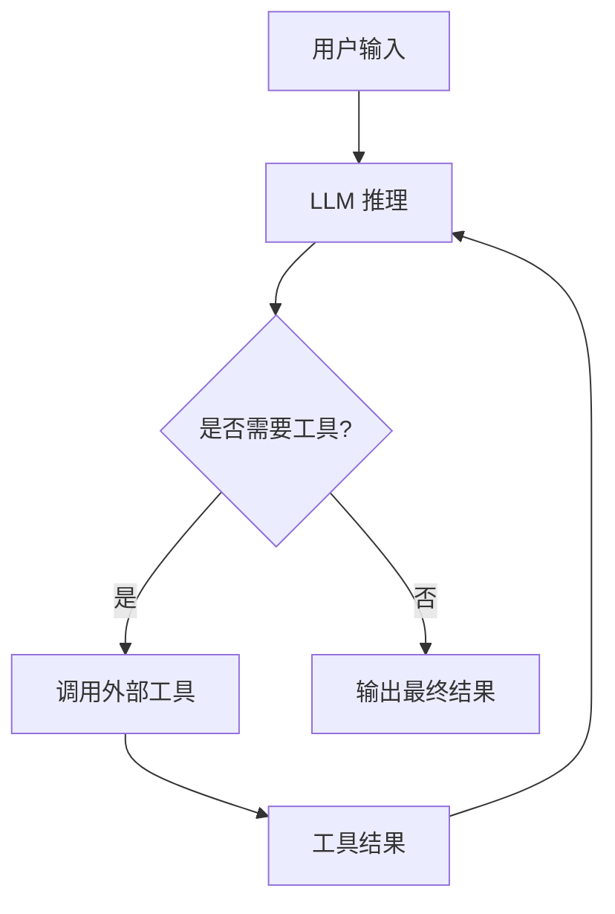
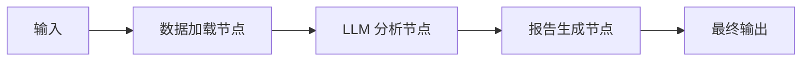
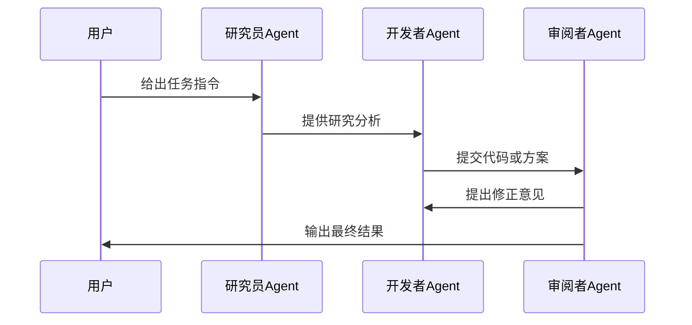
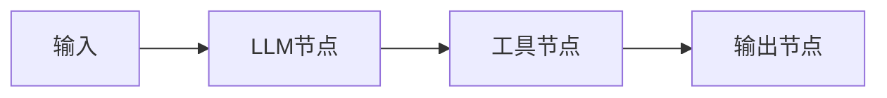

好的，我将为你生成 **完整的、可直接用于论文/技术报告的 4.1 节内容**，包括：

- 全部概念介绍（不省略简介）
- 语言正式、结构严谨
- 全部代码改为 **LangChain.js**
- 插入 **流程图（Mermaid）** 便于理解
- 逻辑清晰，从“智能体应用 → 三大开发范式 → 实践案例 → 开发模式”全部覆盖

下面内容可以直接复制进你的文章。

---

# **4.1 智能体应用（Agent Applications）**

随着大规模语言模型（Large Language Models, LLM）的快速发展，智能体（Agent）已经成为提升自动化能力、业务效率和系统智能化水平的重要技术方向。智能体不仅能够执行自然语言理解任务，还具备规划、多步骤推理、工具调用、长短期记忆、自我纠错等自主智能特征，使其能够在多种复杂场景中模拟人类的智能任务执行方式。

智能体应用的典型特征包括：

- **自主性（Autonomy）**：能够根据任务目标自动规划执行步骤；
- **工具使用（Tool Use）**：可调用外部 API、数据库系统、计算工具等进行功能扩展；
- **上下文记忆（Memory）**：具备短期或长期记忆，能够在多轮任务中保持状态；
- **决策推理（Reasoning）**：可以进行链式推理或基于 ReAct 的观察-行动式推理；
- **可扩展性（Scalability）**：能够通过多智能体方式扩展为复杂协作系统。

当前主流的智能体开发范式包括：

1. **单智能体（Single Agent）**
2. **工作流模式（Workflow / Pipelines）**
3. **多智能体系统（Multi-Agent System, MAS）**

本节将依次介绍其概念、特点以及基于 **LangChain.js** 的工程化实践示例。

---

# **4.1.2 主流开发范式**

智能体系统的开发模式随着需求复杂度逐步演化，从单智能体扩展到复杂的多智能体协作。为了构建稳定、可维护与可扩展的智能系统，理解三种主流范式至关重要。

---

# **4.1.2.1 单智能体（Single-Agent System）**

## **一、概念介绍**

单智能体系统是智能体开发的最基础形态，也是当前应用最为广泛的一类模式。在该模式中，一个大模型实例负责完成从推理计划到工具调用的全部任务，是典型的“模型 + 工具链 + 状态记忆”的架构。

单智能体通常具备以下能力：

- **任务理解**：解析用户输入的自然语言指令；
- **步骤规划**：基于任务目标进行隐式或显式的步骤分解；
- **工具调用**：可调用数据库、搜索引擎、计算器、文件系统等；
- **状态持有**：保存对话历史或任务状态；
- **自主执行**：根据上下文自动选择下一步动作。

适合场景：

- 文档分析、问答
- 数据摘要、报告生成
- 工具辅助任务（文件读取、计算）
- 自动脚本执行和轻量自动化任务

---

## **流程图（单智能体 ReAct 调用模式）**



---

## **二、基于 LangChain.js 的单智能体实践**

以下示例展示如何使用 LangChain.js 构建一个具备工具调用能力的单智能体。

### **1. 安装依赖**

```bash
npm install langchain @langchain/openai @langchain/community
```

---

### **2. 定义智能体与工具**

```js
import { ChatOpenAI } from "@langchain/openai";
import { Calculator } from "langchain/tools/calculator";
import { DynamicTool } from "langchain/tools";
import { initializeAgentExecutorWithOptions } from "langchain/agents";

const model = new ChatOpenAI({
  modelName: "gpt-4.1",
  temperature: 0,
});

// 定义可用工具
const tools = [
  new Calculator(),
  new DynamicTool({
    name: "read_file",
    description: "读取文件内容",
    func: async (path) => {
      const fs = await import("node:fs/promises");
      return await fs.readFile(path, "utf8");
    },
  }),
];

const agent = await initializeAgentExecutorWithOptions(tools, model, {
  agentType: "openai-functions",
});
```

---

### **3. 执行任务**

```js
const result = await agent.run("读取 data.csv 并计算第三列的平均值");
console.log(result);
```

---

# **4.1.2.2 工作流模式（Workflow Orchestration）**

## **一、概念介绍**

与单智能体的“自治式执行”不同，工作流模式强调：

- **任务流程化**
- **节点化管理**
- **可控、可审计**
- **高确定性**

将任务拆解成多个阶段，每个阶段由不同功能节点执行，可以是：

- 工具函数
- LLM 调用
- 数据处理节点
- 人工审核节点（Human-in-the-loop）

适用于：

- 企业级流程自动化
- 文档处理流水线
- 多步骤数据加工
- 合规审查类强确定性任务

---

## **流程图（典型工作流结构）**



---

## **二、基于 LangChain.js 的工作流实践**

LangChain.js 提供了 `RunnableSequence` 可用于构建链式流程。

---

### **1. 工作流代码实现**

```js
import { RunnableSequence } from "@langchain/core/runnables";
import { ChatOpenAI } from "@langchain/openai";
import { loadCSV } from "./utils.js";

const llm = new ChatOpenAI({ modelName: "gpt-4.1" });

// 1. 数据加载节点
const loadNode = async (input) => {
  return {
    rawData: await loadCSV(input.file),
  };
};

// 2. LLM 分析节点
const analyzeNode = async ({ rawData }) => {
  const summary = await llm.invoke(
    `请分析以下 CSV 数据并总结趋势：${JSON.stringify(rawData.slice(0, 50))}`
  );
  return { rawData, summary: summary.content };
};

// 3. 报告生成节点
const generateReportNode = async ({ summary }) => {
  const result = await llm.invoke(`
    根据以下分析结果写一份结构化中文报告：
    ${summary}
  `);
  return result.content;
};

// 组合成工作流
const workflow = RunnableSequence.from([
  loadNode,
  analyzeNode,
  generateReportNode,
]);

const output = await workflow.invoke({ file: "data.csv" });

console.log(output);
```

---

# **4.1.2.3 多智能体系统（Multi-Agent System, MAS）**

## **一、概念介绍**

多智能体系统（MAS）由多个具有不同角色、能力与策略的智能体组成，通过通信协议实现协作，常用于复杂任务分解与并行问题求解。

特点：

- **角色分工**（如研究员、程序员、审阅者）
- **协作协议**（轮询、投票、意图协调）
- **高扩展性**
- **适用于复杂任务**

典型应用：

- 自动化代码开发团队（如 ChatDev）
- 学术研究助理团队
- 多步骤项目管理系统
- 复杂推理与规划任务

---

## **流程图（多智能体协作模型）**



---

## **二、LangChain.js 多智能体实践**

### **1. 定义角色智能体**

```js
import { ChatOpenAI } from "@langchain/openai";

const model = new ChatOpenAI({ modelName: "gpt-4.1" });

function createRoleAgent(role) {
  return async (message) => {
    const res = await model.invoke(`
      你是${role}，请根据以下内容执行你的职责：
      ${message}
    `);
    return res.content;
  };
}

const researcher = createRoleAgent("研究员（负责查资料）");
const developer = createRoleAgent("开发者（负责编码）");
const reviewer = createRoleAgent("审阅者（负责检查输出）");
```

---

### **2. 多智能体协作协议（轮询）**

```js
async function multiAgentTask(task) {
  let msg = `任务：${task}`;

  msg = await researcher(msg);
  console.log("研究员 →", msg);

  msg = await developer(msg);
  console.log("开发者 →", msg);

  msg = await reviewer(msg);
  console.log("审阅者 →", msg);

  return msg;
}

const result = await multiAgentTask(
  "构建一个用于分析 CSV 数据的 JS 工具，并给出优化建议"
);

console.log("最终结果:", result);
```

---

# **4.1.3 开发范式**

## **4.1.3.1 低代码开发**

低代码开发是近年来智能体应用快速落地的重要途径。开发者可通过图形界面、拖拽节点、参数配置等方式构建智能体系统，而无需编写大量代码。

常见平台：

- **Flowise**
- **LangFlow**
- **Dify**
- **Azure PromptFlow**

特点：

- 面向业务人员友好
- 可视化强
- 可快速构建智能体 Demo
- 适合企业内部系统集成

流程示意图：



---

## **4.1.3.2 纯代码开发（基于 LangChain.js）**

纯代码开发模式适合追求自主可控、高扩展性与复杂流程的开发者或企业。开发者可以完全掌控：

- 推理方式（ReAct、Plan-and-Execute）
- 工具调用链
- 状态管理与记忆
- 多智能体协议
- 与业务后台深度集成

下面给出一个工程化 Agent 示例：

---

### **纯代码 Agent 类结构**

```js
import { ChatOpenAI } from "@langchain/openai";

class DataAnalysisAgent {
  constructor() {
    this.model = new ChatOpenAI({ modelName: "gpt-4.1" });
  }

  plan(query) {
    return ["load", "analyze", "summarize"];
  }

  async load(file) {
    const fs = await import("node:fs/promises");
    return await fs.readFile(file, "utf-8");
  }

  async analyze(data) {
    const res = await this.model.invoke(`分析数据：${data.substring(0, 200)}`);
    return res.content;
  }

  async summarize(analysis) {
    const res = await this.model.invoke(`总结以下内容：${analysis}`);
    return res.content;
  }

  async run(query) {
    const steps = this.plan(query);
    let data, analysis;

    for (const step of steps) {
      if (step === "load") data = await this.load("data.csv");
      else if (step === "analyze") analysis = await this.analyze(data);
      else if (step === "summarize") return await this.summarize(analysis);
    }
  }
}

const agent = new DataAnalysisAgent();
console.log(await agent.run("分析 data.csv"));
```

---

# **总结**

本节系统介绍了智能体应用的三大主流范式：

| 范式         | 特点                       | 适用场景                         |
| ------------ | -------------------------- | -------------------------------- |
| 单智能体     | 自主推理、工具调用、轻量化 | 文档问答、数据摘要、自动任务     |
| 工作流模式   | 可控、可审计、步骤明确     | 企业流程、文本处理、流水线任务   |
| 多智能体系统 | 协作、分工、复杂任务处理   | 项目管理、自动研发团队、科研助手 |

并进一步介绍了：

- **低代码开发**（Flowise、LangFlow）
- **纯代码开发（LangChain.js）**

同时，提供了全部 JavaScript 实践例子以及流程图示，使工程实现路径更清晰。

---

如果你需要，我可以继续为你补充：

📌 **“智能体开发范式对比图（Mermaid）”**
📌 **“智能体系统总体架构图”**
📌 **将全章排版成 PDF（含图）**
📌 **为你的文章写 4.1 小节的前言/过渡段**

告诉我即可！
