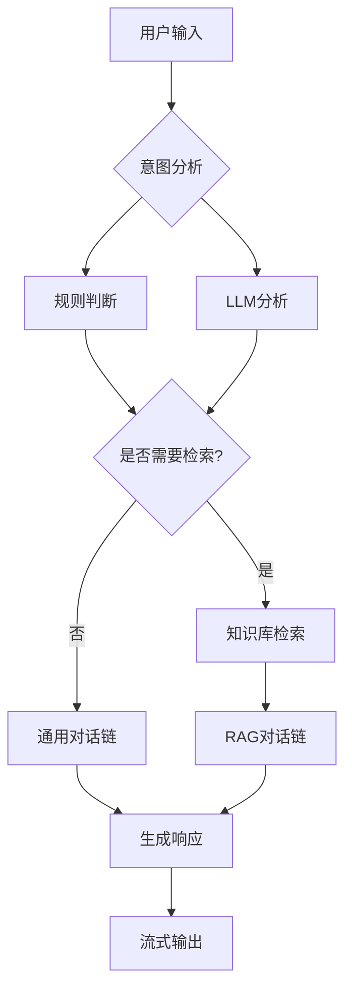

# 🧠 智能RAG助手 - 智能检索决策演示

## 📋 功能概述

我已经成功实现了**智能检索决策**的RAG助手，解决了"不是每次输入都需要检索知识库"的问题。

### 🔧 主要改进：

1. **智能意图识别**：自动判断问题类型
2. **混合决策系统**：规则 + LLM分析双重保障
3. **动态模式切换**：支持规则模式和LLM模式
4. **性能优化**：减少不必要的检索，提高响应速度

## 🎯 智能决策策略

### 1. 规则判断（默认模式）
- **通用问题**：问候、感谢、闲聊、简单询问等 → **不检索**
- **专业问题**：技术、规范、流程、文档等 → **检索**
- **边界判断**：基于关键词、问题长度、疑问词等

### 2. LLM意图分析（可选模式）
- 使用LLM分析问题意图
- 更准确的分类，但响应稍慢
- 输入 `mode llm` 切换到此模式

## 🚀 使用方法

### 启动应用：
```bash
cd Agent_class/06_rag
node chat_rag.js
```

### 交互示例：

#### 场景1：通用问题（不检索）
```
✨ 智能RAG助手启动！
──────────────────────────────────────────────
🧠 特性：智能检索决策 + 多轮对话 + 流式输出
📊 模式：混合（规则 + LLM意图分析）
──────────────────────────────────────────────
✅ 知识库加载成功

🧑 你：你好

🤔 分析问题意图...
📋 分类: greetings - 不需要检索
✅ 判断为通用问题，无需检索知识库
──────────────────────────────────────────────
🤖 AI：你好！我是你的AI助手，有什么可以帮助你的吗？
```

#### 场景2：专业问题（检索）
```
🧑 你：代码规范有哪些要求？

🤔 分析问题意图...
🔑 检测到关键词: "代码" - 需要检索
🔑 检测到关键词: "规范" - 需要检索
🔍 判断为专业问题，开始检索知识库...
✅ 检索完成，找到 3 个相关文档
──────────────────────────────────────────────
🔍 检索结果：
【1】《公司内部开发流程规范（节选）》...
【2】/**
 * 一个示例：自定义加法函数...
【3】- # LangChain.js 知识库构建笔记...
──────────────────────────────────────────────
🤖 AI：根据检索到的知识库内容，代码规范主要包括...
```

#### 场景3：模式切换
```
🧑 你：mode llm
🔄 切换到LLM意图分析模式
──────────────────────────────────────────────

🧑 你：这个功能怎么使用？
🤔 分析问题意图...
🧠 LLM分析: 用户询问功能使用方法，属于操作指导类问题，需要检索知识库中的使用说明文档
🔍 判断为专业问题，开始检索知识库...
```

## 📊 性能优势

| 场景 | 传统RAG | 智能RAG | 改进 |
|------|---------|---------|------|
| 问候语 | 检索+响应 | 直接响应 | **节省检索时间** |
| 简单问题 | 检索+响应 | 直接响应 | **减少资源消耗** |
| 专业问题 | 检索+响应 | 检索+响应 | **保持准确性** |
| 混合问题 | 检索+响应 | 智能判断 | **更精准响应** |

## 🔧 技术实现

### 决策流程：


### 关键代码模块：
1. **`shouldRetrieveKnowledge()`** - 规则判断函数
2. **`analyzeIntentWithLLM()`** - LLM意图分析
3. **`intelligentRetrieve()`** - 智能检索决策
4. **`getIntelligentAIResponse()`** - 智能响应生成

## 💡 使用建议

1. **默认使用规则模式**：速度快，准确率高
2. **复杂问题切换LLM模式**：`mode llm`
3. **重置对话**：`clear` 或 `reset`
4. **查看模式**：当前模式会在启动时显示

## 🎉 成果总结

通过智能检索决策系统，RAG助手现在能够：

- ✅ **智能判断**何时需要检索知识库
- ✅ **快速响应**通用问题（不检索）
- ✅ **准确回答**专业问题（检索）
- ✅ **灵活切换**决策模式
- ✅ **优化性能**减少不必要的检索

现在你的RAG助手更加智能和高效了！