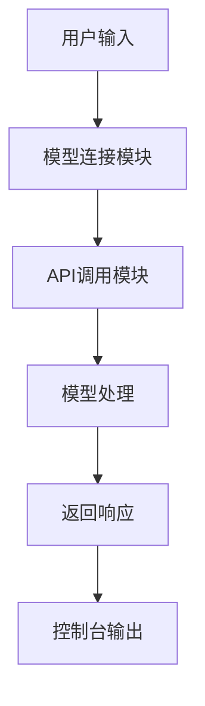

# 00_basic.js - 基础对话模型

## 概述
这是Agent开发的第一课，展示了最基础的AI对话模型实现。通过这个简单的例子，学员可以了解如何连接到本地LLM模型（Ollama）并进行基本的API调用。

## 功能模块

### 1. 模型连接模块
```javascript
const llm = new ChatOllama({
  model: "llama3.1:8b",
  baseUrl: "http://localhost:11434",
});
```
- **功能**：建立与本地Ollama服务的连接
- **参数**：
  - `model`: 指定使用的模型名称（llama3.1:8b）
  - `baseUrl`: Ollama服务的URL地址

### 2. API调用模块
```javascript
const res = await llm.invoke("你好！你是谁？");
console.log(res);
```
- **功能**：向模型发送请求并获取响应
- **方法**：`invoke()` - 同步调用方法
- **输入**：字符串类型的用户问题
- **输出**：模型生成的完整响应

## 模块交互图



## 流程说明

1. **初始化阶段**：创建ChatOllama实例，配置模型参数
2. **请求阶段**：调用`invoke()`方法发送用户查询
3. **处理阶段**：模型在本地处理查询并生成响应
4. **输出阶段**：将完整响应输出到控制台

## 技术特点

1. **简单性**：只有两个核心函数调用
2. **同步性**：使用`await`进行同步调用
3. **基础性**：不包含记忆、流式输出等高级功能
4. **本地化**：依赖本地Ollama服务，无需网络连接

## 学习要点

1. **理解ChatOllama类**：学习如何使用LangChain的Ollama集成
2. **掌握invoke方法**：了解基本的模型调用方式
3. **配置模型参数**：学习如何指定模型和连接地址
4. **处理异步响应**：理解async/await在AI调用中的应用

## 使用示例

运行命令：
```bash
node 00_basic.js
```

输出示例：
```
AIMessage {
  content: "你好！我是DeepSeek，一个AI助手...",
  additional_kwargs: {},
  response_metadata: { ... }
}
```

## 扩展思考

1. 如果要支持流式输出，应该如何修改？
2. 如果需要记忆功能，应该添加什么模块？
3. 如果要支持多轮对话，架构应该如何设计？

## 注意事项

1. **确保Ollama服务运行**：运行前需要启动`ollama serve`
2. **确保模型已下载**：需要先执行`ollama pull llama3.1:8b`
3. **响应格式**：返回的是AIMessage对象，需要通过`content`属性获取文本

## 版本演进

这是整个课程的基础起点，后续所有版本都是在这个基础上逐步添加功能：
- 01版本：添加记忆功能
- 02版本：添加流式输出
- 03版本：结合记忆和流式输出
- 04版本：添加终端交互界面
- 05版本：美化终端界面
- 06版本：添加RAG功能
- 07版本：智能检索决策
- 08版本：工具调用功能
- 09版本：模块化整合
- 010版本：进一步优化