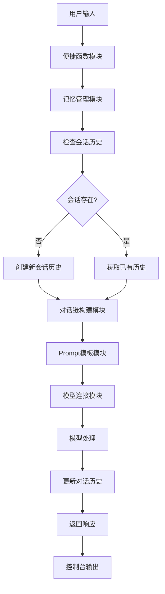

# 01_chat.js - 带记忆的多轮对话助手

## 概述
在第一课基础上添加了记忆功能，实现了能够记住对话历史的多轮对话助手。这是构建实用聊天机器人的重要一步。

## 功能模块

### 1. 模型连接模块
```javascript
const model = new ChatOllama({
  model: "llama3.1:8b",
  baseUrl: "http://localhost:11434",
});
```
- **功能**：连接本地Ollama模型
- **保持性**：与00版本相同的基础连接

### 2. Prompt模板模块
```javascript
const prompt = ChatPromptTemplate.fromMessages([
  ["system", "你是一个友好的 AI 助手。"],
  ["placeholder", "{history}"],
  ["human", "{input}"],
]);
```
- **功能**：定义对话模板结构
- **结构**：
  - `system`: 系统角色设定
  - `placeholder`: 历史对话占位符
  - `human`: 用户输入占位符

### 3. 对话链构建模块
```javascript
const chain = RunnableSequence.from([prompt, model]);
```
- **功能**：将prompt模板和模型组合成可执行链
- **特点**：实现了`prompt → model`的流水线处理

### 4. 记忆管理模块
```javascript
const store = new Map();
const withMemory = new RunnableWithMessageHistory({
  runnable: chain,
  getMessageHistory: (sessionId) => {
    if (!store.has(sessionId)) {
      store.set(sessionId, new InMemoryChatMessageHistory());
    }
    return store.get(sessionId);
  },
  inputMessagesKey: "input",
  historyMessagesKey: "history",
});
```
- **核心组件**：
  - `store`: 内存存储，管理不同会话的历史记录
  - `RunnableWithMessageHistory`: 为对话链添加记忆功能
- **会话管理**：基于sessionId区分不同用户的对话历史
- **历史存储**：使用`InMemoryChatMessageHistory`在内存中保存对话

### 5. 便捷函数模块
```javascript
async function ask(text) {
  const res = await withMemory.invoke(
    { input: text },
    { configurable: { sessionId: "user-session-1" } }
  );
  console.log("\nAI:", res.content);
}
```
- **功能**：封装对话调用逻辑
- **参数**：用户输入文本
- **输出**：将AI响应输出到控制台

## 模块交互图



## 数据流说明

1. **输入阶段**：用户通过`ask()`函数输入问题
2. **记忆检索**：根据sessionId查找或创建对话历史
3. **模板填充**：将历史对话和当前输入填充到prompt模板
4. **模型处理**：模型基于完整上下文生成响应
5. **历史更新**：将当前对话对添加到历史记录
6. **输出响应**：返回并显示AI的回复

## 记忆机制详解

### 存储结构
```javascript
// store的数据结构
{
  "user-session-1": InMemoryChatMessageHistory([
    HumanMessage("你好，我叫小蔡。"),
    AIMessage("你好小蔡！很高兴认识你。"),
    HumanMessage("我刚才说我叫什么？"),
    AIMessage("你刚才说你叫小蔡。")
  ]),
  "user-session-2": InMemoryChatMessageHistory([...])
}
```

### 历史管理策略
1. **会话隔离**：不同sessionId的用户有独立的对话历史
2. **自动创建**：首次访问时自动初始化历史记录
3. **持续累积**：每次对话都会添加新的消息到历史中
4. **内存存储**：重启程序后历史会丢失（后续版本可能持久化）

## 技术特点

1. **多轮对话**：能够基于历史上下文进行连续对话
2. **会话管理**：支持多个独立对话线程
3. **模板化prompt**：使用结构化模板管理对话格式
4. **链式处理**：通过RunnableSequence组织处理流程
5. **内存记忆**：简单高效的对话历史存储

## 测试用例

```javascript
// 测试多轮对话
await ask("你好，我叫小蔡。");
await ask("我刚才说我叫什么？");
await ask("你觉得我适合学编程吗？");
```

**输出示例**：
```
AI: 你好小蔡！很高兴认识你。

AI: 你刚才说你叫小蔡。

AI: 学习编程需要逻辑思维和耐心，任何人都可以学习...
```

## 学习要点

1. **理解RunnableSequence**：学习LangChain的链式编程模式
2. **掌握记忆管理**：了解如何为AI添加对话记忆
3. **学习会话隔离**：理解多用户对话管理
4. **掌握模板系统**：学习使用ChatPromptTemplate构建对话模板

## 与00版本的对比

| 特性 | 00_basic.js | 01_chat.js |
|------|-------------|------------|
| 记忆功能 | ❌ 无 | ✅ 有 |
| 多轮对话 | ❌ 单次 | ✅ 支持 |
| 会话管理 | ❌ 无 | ✅ 有 |
| 代码复杂度 | 简单 | 中等 |
| 实用性 | 低 | 高 |

## 扩展思考

1. 如果要将记忆持久化到数据库，应该如何修改？
2. 如何限制对话历史的长度，避免token超限？
3. 如何实现跨会话的记忆共享？
4. 如果要添加流式输出，应该在哪里修改？

## 注意事项

1. **内存使用**：长时间对话可能导致内存占用增加
2. **历史长度**：没有限制历史长度，可能影响性能
3. **会话泄漏**：大量不活跃会话可能占用内存
4. **重启丢失**：程序重启后所有记忆都会丢失

## 版本演进位置

这是课程的第二课，在基础对话上添加了核心的记忆功能：
- **前身**：00_basic.js（基础对话）
- **本版**：01_chat.js（记忆对话）
- **后继**：02_stream.js（添加流式输出）