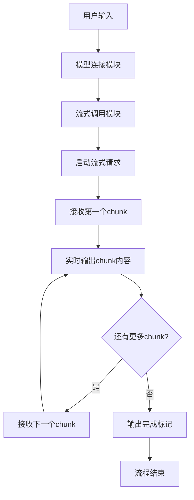

# 02_stream.js - 流式输出示例

## 概述
在基础对话模型上添加流式输出功能，实现了实时逐字显示AI响应的效果。这是提升用户体验的重要改进。

## 功能模块

### 1. 模型连接模块
```javascript
const model = new ChatOllama({
  model: "llama3.1:8b",
  baseUrl: "http://localhost:11434",
});
```
- **功能**：连接本地Ollama模型
- **保持性**：与之前版本相同的配置

### 2. 流式调用模块
```javascript
const stream = await model.stream("给我讲一个有趣的猫咪小知识");
for await (const chunk of stream) {
  process.stdout.write(chunk.content); // 实时输出
}
```
- **核心方法**：`stream()` - 替代`invoke()`的流式调用方法
- **迭代处理**：使用`for await...of`循环逐块处理响应
- **实时输出**：`process.stdout.write()`实现逐字显示

## 模块交互图



## 流式处理流程

### 1. 请求启动阶段
```javascript
const stream = await model.stream("给我讲一个有趣的猫咪小知识");
```
- **方法调用**：使用`stream()`而非`invoke()`
- **返回类型**：返回一个AsyncIterable对象
- **连接建立**：与模型建立流式连接通道

### 2. 数据接收阶段
```javascript
for await (const chunk of stream) {
  // chunk数据结构示例
  // {
  //   content: "猫",
  //   additional_kwargs: {},
  //   response_metadata: {...}
  // }
  process.stdout.write(chunk.content);
}
```
- **迭代处理**：异步迭代器逐块获取响应
- **chunk结构**：每个chunk包含部分文本内容
- **实时输出**：立即显示接收到的内容

### 3. 输出完成阶段
```javascript
console.log("\n\n--- 完成 ---");
```
- **结束标记**：显示流式输出完成
- **格式美化**：添加换行和分隔线

## 技术特点

### 1. 异步迭代模式
```javascript
// 传统同步模式（01版本）
const res = await model.invoke(query);
console.log(res.content);

// 流式异步模式（02版本）
const stream = await model.stream(query);
for await (const chunk of stream) {
  process.stdout.write(chunk.content);
}
```

### 2. 实时性优势
- **立即反馈**：用户无需等待完整响应
- **渐进显示**：文本逐字出现，类似人类打字
- **交互感强**：提升用户体验和参与感

### 3. 内存效率
- **分块处理**：不需要等待完整响应再处理
- **增量显示**：边接收边显示，减少内存占用
- **及时中断**：可以在任意chunk后中断处理

## 与01版本的对比

| 特性 | 01_chat.js | 02_stream.js |
|------|------------|--------------|
| 输出方式 | 批量输出 | 流式输出 |
| 响应时间 | 等待完整响应 | 立即开始显示 |
| 用户体验 | 等待感明显 | 实时互动感强 |
| 内存使用 | 一次性加载 | 分块加载 |
| 代码复杂度 | 简单 | 中等 |

## 测试示例

**输入**：
```javascript
const stream = await model.stream("给我讲一个有趣的猫咪小知识");
```

**输出过程**：
```
猫（停顿0.5秒）咪（停顿0.3秒）的（停顿0.2秒）胡（停顿0.4秒）须...
（逐字显示，类似打字效果）
```

**最终输出**：
```
猫咪的胡须不仅仅是装饰，它们是非常敏感的触觉器官...
--- 完成 ---
```

## 学习要点

### 1. 掌握流式API
- 理解`stream()`与`invoke()`的区别
- 学习处理AsyncIterable对象
- 掌握`for await...of`循环用法

### 2. 优化输出体验
- 使用`process.stdout.write()`实时输出
- 避免使用`console.log()`的自动换行
- 控制输出节奏和格式

### 3. 错误处理
```javascript
try {
  const stream = await model.stream(query);
  for await (const chunk of stream) {
    if (chunk?.content) {
      process.stdout.write(chunk.content);
    }
  }
} catch (error) {
  console.error("流式输出错误:", error);
}
```

## 潜在问题与解决方案

### 1. 输出混乱问题
**现象**：多行输出时格式混乱
**解决**：合理控制换行，使用`\n`手动换行

### 2. 网络中断问题
**现象**：流式连接中途断开
**解决**：添加错误处理和重试机制

### 3. 性能问题
**现象**：大量小chunk导致频繁IO
**解决**：适当缓冲多个chunk后批量输出

## 扩展思考

1. **如何结合记忆功能**：在03版本中会实现
2. **如何添加打字机效果**：控制chunk之间的时间间隔
3. **如何支持彩色输出**：使用ANSI颜色代码
4. **如何添加进度指示**：显示已接收比例

## 实际应用场景

1. **聊天机器人**：更自然的对话体验
2. **代码生成**：实时查看生成过程
3. **故事创作**：观看故事逐步展开
4. **教学助手**：逐步解释复杂概念

## 版本演进位置

这是课程的第三课，专注于流式输出技术：
- **前身**：01_chat.js（记忆对话）
- **本版**：02_stream.js（流式输出）
- **后继**：03_chat_stream.js（结合记忆和流式）

## 注意事项

1. **Ollama支持**：确保使用的模型支持流式输出
2. **网络稳定性**：流式连接对网络要求更高
3. **输出控制**：注意控制输出频率，避免过快
4. **错误处理**：流式连接更容易出现中断，需要完善错误处理