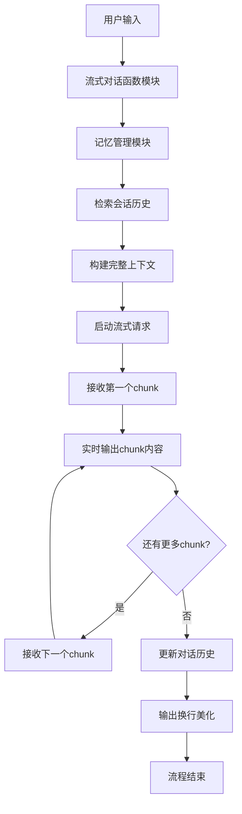

# 03_chat_stream.js - 聊天流式输出

## 概述
将前两课的功能结合起来，实现了带记忆的多轮对话 + 流式输出的完整聊天助手。这是向实用聊天机器人迈进的关键一步。

## 功能模块

### 1. 模型连接模块
```javascript
const model = new ChatOllama({
  model: "llama3.1:8b",
  baseUrl: "http://localhost:11434",
});
```
- **功能**：连接本地Ollama模型
- **一致性**：与前两个版本配置相同

### 2. Prompt模板模块
```javascript
const prompt = ChatPromptTemplate.fromMessages([
  ["system", "你是一个优秀的 AI 助手。"],
  ["placeholder", "{history}"],
  ["human", "{input}"],
]);
```
- **功能**：定义对话模板
- **改进**：优化了system prompt内容
- **结构**：保持三部分结构（系统角色、历史、输入）

### 3. 对话链构建模块
```javascript
const chain = RunnableSequence.from([prompt, model]);
```
- **功能**：组合prompt和模型
- **作用**：创建可执行的对话处理流水线

### 4. 记忆管理模块
```javascript
const store = new Map();
const withMemory = new RunnableWithMessageHistory({
  runnable: chain,
  getMessageHistory: (sessionId) => {
    if (!store.has(sessionId)) {
      store.set(sessionId, new InMemoryChatMessageHistory());
    }
    return store.get(sessionId);
  },
  inputMessagesKey: "input",
  historyMessagesKey: "history",
});
```
- **功能**：为对话链添加记忆功能
- **存储**：基于Map的会话历史管理
- **历史类型**：InMemoryChatMessageHistory

### 5. 流式对话函数模块
```javascript
async function askStream(text) {
  const stream = await withMemory.stream(
    { input: text },
    { configurable: { sessionId: "session1" } }
  );

  console.log("\nAI: ");
  for await (const chunk of stream) {
    if (chunk?.content) {
      process.stdout.write(chunk.content);
    }
  }
  console.log("\n");
}
```
- **核心创新**：结合记忆的流式调用
- **方法**：`withMemory.stream()` - 记忆增强的流式方法
- **输出控制**：添加AI前缀，美化输出格式

## 模块交互图



## 技术融合细节

### 1. 记忆与流式的结合
```javascript
// 01版本的记忆调用（非流式）
const res = await withMemory.invoke(
  { input: text },
  { configurable: { sessionId: "session1" } }
);

// 03版本的记忆流式调用
const stream = await withMemory.stream(
  { input: text },
  { configurable: { sessionId: "session1" } }
);
```

### 2. 上下文构建流程
1. **历史检索**：根据sessionId获取对话历史
2. **模板填充**：将历史填充到`{history}`占位符
3. **输入整合**：将当前输入填充到`{input}`占位符
4. **流式发送**：将完整上下文以流式方式发送给模型

### 3. 输出处理优化
```javascript
console.log("\nAI: ");  // 添加AI前缀
for await (const chunk of stream) {
  if (chunk?.content) {
    process.stdout.write(chunk.content);  // 逐字输出
  }
}
console.log("\n");  // 结束换行
```

## 会话数据流示例

### 第一次对话
**用户输入**：`"你好，我叫小蔡。"`
**上下文构建**：
```
系统: 你是一个优秀的 AI 助手。
历史: （空）
人类: 你好，我叫小蔡。
```
**AI响应**：`"你好小蔡！很高兴认识你。"`（流式显示）
**更新历史**：添加`HumanMessage("你好，我叫小蔡。")`和`AIMessage("你好小蔡！很高兴认识你。")`

### 第二次对话
**用户输入**：`"我刚才说我叫什么？"`
**上下文构建**：
```
系统: 你是一个优秀的 AI 助手。
历史: 人类: 你好，我叫小蔡。
       AI: 你好小蔡！很高兴认识你。
人类: 我刚才说我叫什么？
```
**AI响应**：`"你刚才说你叫小蔡。"`（流式显示）

## 与之前版本的对比

| 特性 | 01_chat.js | 02_stream.js | 03_chat_stream.js |
|------|------------|--------------|-------------------|
| 记忆功能 | ✅ 有 | ❌ 无 | ✅ 有 |
| 流式输出 | ❌ 无 | ✅ 有 | ✅ 有 |
| 多轮对话 | ✅ 支持 | ❌ 单次 | ✅ 支持 |
| 实时体验 | 差 | 好 | 优秀 |
| 代码复杂度 | 中等 | 简单 | 中等 |

## 测试用例

```javascript
// 🔥 测试多轮对话 + 流式输出
await askStream("你好，我叫小蔡。");
await askStream("我刚才说我叫什么？");
await askStream("我适合学编程吗？");
```

**输出效果**：
```
AI: 你好小蔡！很高兴认识你。

AI: 你刚才说你叫小蔡。

AI: 学习编程需要逻辑思维和耐心...
（每个响应都是逐字流式显示）
```

## 关键技术点

### 1. RunnableWithMessageHistory.stream()
- **作用**：记忆增强的流式调用方法
- **参数**：与`invoke()`相同的配置格式
- **返回**：AsyncIterable流式响应

### 2. 错误安全处理
```javascript
if (chunk?.content) {
  process.stdout.write(chunk.content);
}
```
- **空值检查**：确保chunk有content属性
- **安全输出**：避免undefined输出

### 3. 输出格式化
- **前缀标识**：`console.log("\nAI: ")`明确标识AI响应
- **结束换行**：`console.log("\n")`美化输出格式
- **流式连贯**：使用`process.stdout.write()`保持流式效果

## 潜在优化方向

### 1. 性能优化
```javascript
// 可能的优化：批量处理chunk
let buffer = "";
for await (const chunk of stream) {
  if (chunk?.content) {
    buffer += chunk.content;
    if (buffer.length > 50 || chunk.content.includes("\n")) {
      process.stdout.write(buffer);
      buffer = "";
    }
  }
}
if (buffer) process.stdout.write(buffer);
```

### 2. 用户体验优化
- 添加打字机效果（chunk间延迟）
- 支持彩色输出
- 添加进度指示器

### 3. 错误处理增强
- 网络中断重试
- 超时处理
- 优雅降级（流式失败时回退到批量）

## 实际应用价值

1. **客服聊天机器人**：自然的多轮对话体验
2. **编程助手**：实时代码解释和生成
3. **教育工具**：渐进式知识讲解
4. **创作助手**：流式故事创作

## 版本演进意义

这是课程的第四课，实现了前两课功能的完美结合：
- **集成成果**：记忆 + 流式 = 实用聊天助手
- **架构验证**：证明了模块化设计的可行性
- **用户体验**：达到了接近商业产品的对话体验

## 注意事项

1. **历史长度管理**：长时间对话可能导致token超限
2. **流式稳定性**：网络波动可能影响流式连接
3. **内存管理**：大量会话历史可能占用较多内存
4. **输出控制**：需要合理控制输出节奏和格式