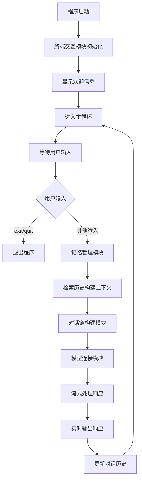

# 04_terminal_chat.js - 终端交互式聊天助手

## 概述
在前几课的基础上，添加了完整的终端交互界面，实现了真正可用的命令行聊天工具。用户可以通过终端与AI进行连续的多轮对话。

## 功能模块

### 1. 模型连接模块
```javascript
const model = new ChatOllama({
  model: "llama3.1:8b",
  baseUrl: "http://localhost:11434",
});
```
- **功能**：连接本地Ollama模型
- **稳定性**：保持与前版本一致的配置

### 2. Prompt模板模块
```javascript
const prompt = ChatPromptTemplate.fromMessages([
  ["system", "你是一个友好的 AI 助手，回答要简洁、有礼貌。"],
  ["placeholder", "{history}"],
  ["human", "{input}"],
]);
```
- **功能**：定义对话模板
- **优化**：改进了system prompt，强调简洁有礼貌
- **结构**：标准的三段式结构

### 3. 对话链构建模块
```javascript
const chain = RunnableSequence.from([prompt, model]);
```
- **功能**：组合prompt和模型
- **作用**：创建可执行的对话处理流水线

### 4. 记忆管理模块
```javascript
const sessionStore = new Map();
const chat = new RunnableWithMessageHistory({
  runnable: chain,
  getMessageHistory: (sessionId) => {
    if (!sessionStore.has(sessionId)) {
      sessionStore.set(sessionId, new InMemoryChatMessageHistory());
    }
    return sessionStore.get(sessionId);
  },
  inputMessagesKey: "input",
  historyMessagesKey: "history",
});
```
- **功能**：管理对话历史
- **存储**：基于Map的会话存储
- **命名优化**：变量名更语义化（sessionStore, chat）

### 5. 终端交互模块
```javascript
const rl = readline.createInterface({
  input: process.stdin,
  output: process.stdout,
});
```
- **核心库**：Node.js内置`readline`模块
- **功能**：创建命令行交互接口
- **配置**：使用标准输入输出流

### 6. 主循环控制模块
```javascript
async function main() {
  console.log("🟢 多轮对话助手已启动（输入 exit/quit 退出）\n");

  while (true) {
    // 等待用户输入
    const userInput = await new Promise((resolve) =>
      rl.question("你：", resolve)
    );

    // 退出条件
    if (["exit", "quit"].includes(userInput.toLowerCase())) {
      console.log("👋 已退出聊天助手，再见！");
      process.exit(0);
    }

    // 流式输出响应
    const stream = await chat.stream(
      { input: userInput },
      { configurable: { sessionId: "default-session" } }
    );

    process.stdout.write("🤖："); // 提示
    for await (const chunk of stream) {
      if (chunk?.content) process.stdout.write(chunk.content);
    }
    console.log("\n"); // 换行
  }
}
```
- **核心功能**：无限循环的对话主程序
- **用户输入**：使用`rl.question()`获取用户输入
- **退出机制**：支持exit/quit命令退出
- **流式响应**：结合记忆的流式输出
- **界面美化**：添加表情符号和格式控制

## 模块交互图



## 交互流程详解

### 1. 启动阶段
```
🟢 多轮对话助手已启动（输入 exit/quit 退出）

你：
```
- **欢迎信息**：显示程序状态和退出指令
- **输入提示**：显示"你："等待用户输入

### 2. 对话阶段
```
你：你好，我是小明
🤖：你好小明！很高兴认识你。

你：我刚才说了什么？
🤖：你刚才说你叫小明。
```
- **输入格式**：`你：`前缀
- **输出格式**：`🤖：`前缀 + 流式响应
- **换行分隔**：每次对话后空行分隔

### 3. 退出阶段
```
你：exit
👋 已退出聊天助手，再见！
```
- **退出命令**：支持exit/quit（不区分大小写）
- **退出信息**：友好的告别信息
- **进程退出**：调用`process.exit(0)`结束程序

## 关键技术实现

### 1. 异步输入处理
```javascript
const userInput = await new Promise((resolve) =>
  rl.question("你：", resolve)
);
```
- **Promise封装**：将回调式API转为Promise
- **异步等待**：使用await等待用户输入
- **简洁语法**：箭头函数简化代码

### 2. 退出机制设计
```javascript
if (["exit", "quit"].includes(userInput.toLowerCase())) {
  console.log("👋 已退出聊天助手，再见！");
  process.exit(0);
}
```
- **命令检测**：检查输入是否为退出命令
- **大小写不敏感**：使用`toLowerCase()`标准化
- **优雅退出**：显示告别信息后退出进程

### 3. 输出格式化
```javascript
process.stdout.write("🤖："); // 使用write避免自动换行
for await (const chunk of stream) {
  if (chunk?.content) process.stdout.write(chunk.content);
}
console.log("\n"); // 手动添加换行
```
- **前缀输出**：先输出AI标识
- **流式连贯**：使用`process.stdout.write()`保持流式
- **结束换行**：手动添加换行美化格式

## 与之前版本的对比

| 特性 | 03_chat_stream.js | 04_terminal_chat.js |
|------|-------------------|---------------------|
| 交互方式 | 硬编码测试用例 | 终端实时交互 |
| 退出机制 | 程序自动结束 | 用户控制退出 |
| 用户体验 | 开发者测试 | 终端用户可用 |
| 代码结构 | 简单函数 | 完整应用结构 |
| 实用性 | 低 | 高 |

## 测试体验

**启动程序**：
```bash
node 04_terminal_chat.js
```

**交互示例**：
```
🟢 多轮对话助手已启动（输入 exit/quit 退出）

你：你好
🤖：你好！有什么可以帮助你的吗？

你：今天天气怎么样
🤖：作为一个AI助手，我无法获取实时天气信息...

你：exit
👋 已退出聊天助手，再见！
```

## 学习要点

### 1. 终端交互编程
- 掌握`readline`模块的基本使用
- 学习将回调式API转为Promise
- 理解终端输入输出的控制

### 2. 程序流程控制
- 无限循环的交互模式设计
- 用户控制的退出机制
- 错误处理和程序稳定性

### 3. 用户体验设计
- 友好的提示信息设计
- 清晰的输入输出格式
- 流畅的交互流程

## 潜在改进方向

### 1. 功能增强
```javascript
// 添加清空历史命令
if (userInput.toLowerCase() === "clear") {
  sessionStore.delete("default-session");
  console.log("🧹 对话历史已清空");
  continue;
}

// 添加帮助命令
if (userInput.toLowerCase() === "help") {
  console.log("可用命令：exit, quit, clear, help");
  continue;
}
```

### 2. 错误处理优化
- 网络中断自动重试
- 输入验证和过滤
- 优雅的错误信息显示

### 3. 界面美化
- 添加颜色输出
- 改进提示符号
- 添加分隔线

## 实际应用价值

1. **个人助手**：命令行下的个人AI助手
2. **开发工具**：编程问题实时解答
3. **学习工具**：交互式知识问答
4. **原型验证**：快速验证AI应用想法

## 版本演进意义

这是课程的第五课，实现了从代码演示到实用工具的转变：
- **交互性**：从硬编码测试到实时交互
- **完整性**：完整的启动-运行-退出流程
- **实用性**：真正可用的命令行工具
- **用户体验**：考虑了终端用户的使用体验

## 注意事项

1. **输入处理**：需要处理空输入和特殊字符
2. **会话管理**：只有一个默认会话，后续可扩展多会话
3. **资源清理**：程序退出时应该清理资源
4. **错误恢复**：网络或模型错误时应友好提示