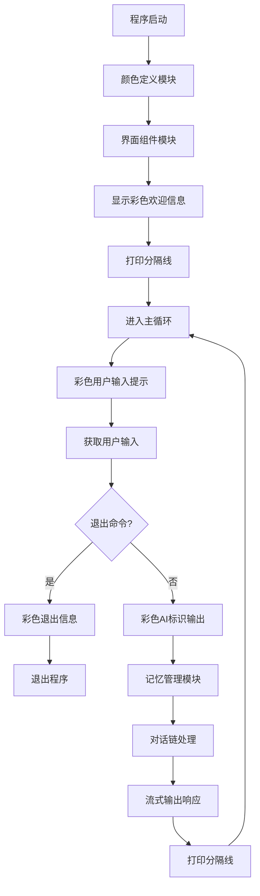

# 05_terminal_chat_ui.js - 美化终端聊天界面

## 概述
在04版本的基础上，添加了终端颜色输出和界面美化，提升了用户体验。通过ANSI转义码实现彩色输出、分隔线和更好的视觉层次。

## 功能模块

### 1. 颜色定义模块
```javascript
const color = {
  reset: "\x1b[0m",
  bright: "\x1b[1m",
  dim: "\x1b[2m",
  cyan: "\x1b[36m",
  yellow: "\x1b[33m",
  magenta: "\x1b[35m",
  green: "\x1b[32m",
};
```
- **功能**：定义ANSI颜色代码常量
- **颜色集**：
  - `reset`: 重置颜色
  - `bright`: 亮色
  - `dim`: 暗色
  - `cyan`: 青色（用于标题）
  - `yellow`: 黄色（用于用户输入）
  - `magenta`: 洋红色（用于退出信息）
  - `green`: 绿色（用于AI响应）

### 2. 界面组件模块
```javascript
function line() {
  console.log(
    color.dim + "──────────────────────────────────────────────" + color.reset
  );
}
```
- **功能**：打印分隔线
- **样式**：使用dim颜色（灰色）的分隔线
- **作用**：视觉上分隔不同对话轮次

### 3. 模型连接模块
```javascript
const model = new ChatOllama({
  model: "llama3.1:8b",
  baseUrl: "http://localhost:11434",
});
```
- **功能**：连接本地Ollama模型
- **保持性**：与前版本相同

### 4. Prompt模板模块
```javascript
const prompt = ChatPromptTemplate.fromMessages([
  ["system", "你是一个友好的 AI 助手，回答要简洁、有礼貌。"],
  ["placeholder", "{history}"],
  ["human", "{input}"],
]);
```
- **功能**：定义对话模板
- **一致性**：与04版本相同

### 5. 对话链构建模块
```javascript
const chain = RunnableSequence.from([prompt, model]);
```
- **功能**：组合prompt和模型
- **标准性**：标准链式构建

### 6. 记忆管理模块
```javascript
const store = new Map();
const chat = new RunnableWithMessageHistory({
  runnable: chain,
  getMessageHistory: (sessionId) => {
    if (!store.has(sessionId)) {
      store.set(sessionId, new InMemoryChatMessageHistory());
    }
    return store.get(sid);
  },
  inputMessagesKey: "input",
  historyMessagesKey: "history",
});
```
- **功能**：管理对话历史
- **优化**：变量名简化（store替代sessionStore）

### 7. 终端交互模块
```javascript
const rl = readline.createInterface({
  input: process.stdin,
  output: process.stdout,
});
```
- **功能**：创建命令行交互接口
- **标准配置**：与04版本相同

### 8. 主界面控制模块
```javascript
async function main() {
  console.log(
    "\n" +
      color.cyan +
      "✨ AI 对话助手已启动！(输入 exit / quit 退出)" +
      color.reset
  );
  line();

  while (true) {
    const userInput = await new Promise((resolve) =>
      rl.question(color.yellow + "🧑 你：" + color.reset, resolve)
    );

    // 退出处理
    if (["exit", "quit"].includes(userInput.toLowerCase())) {
      console.log(color.magenta + "\n👋 已退出聊天助手，再见！" + color.reset);
      process.exit(0);
    }

    // 输出助手标识
    console.log(color.green + "🤖 AI：" + color.reset);

    // 流式输出
    const stream = await chat.stream(
      { input: userInput },
      { configurable: { sessionId: "session1" } }
    );

    for await (const chunk of stream) {
      if (chunk?.content) process.stdout.write(chunk.content);
    }

    console.log("\n");
    line();
  }
}
```
- **核心功能**：彩色交互主循环
- **界面美化**：全面应用颜色和符号
- **流程优化**：改进输出顺序和格式

## 模块交互图



## 界面美化细节

### 1. 欢迎界面
```javascript
console.log(
  "\n" +
    color.cyan +
    "✨ AI 对话助手已启动！(输入 exit / quit 退出)" +
    color.reset
);
line();
```
- **效果**：青色标题 + 分隔线
- **符号**：使用✨增加视觉吸引力
- **结构**：空行 + 标题 + 分隔线

### 2. 用户输入界面
```javascript
rl.question(color.yellow + "🧑 你：" + color.reset, resolve)
```
- **效果**：黄色"🧑 你："提示
- **符号**：🧑人物表情
- **重置**：及时重置颜色避免影响后续输出

### 3. AI响应界面
```javascript
console.log(color.green + "🤖 AI：" + color.reset);
```
- **效果**：绿色"🤖 AI："标识
- **符号**：🤖机器人表情
- **位置**：在流式输出前显示标识

### 4. 退出界面
```javascript
console.log(color.magenta + "\n👋 已退出聊天助手，再见！" + color.reset);
```
- **效果**：洋红色退出信息
- **符号**：👋挥手表情
- **格式**：先换行再显示信息

### 5. 分隔线组件
```javascript
// 分隔线效果
──────────────────────────────────────────────
```
- **颜色**：dim（灰色）
- **长度**：固定50字符
- **作用**：清晰分隔对话轮次

## ANSI颜色代码详解

### 基本格式
```
\x1b[XXm文本\x1b[0m
```
- `\x1b[`: 转义序列开始
- `XX`: 颜色代码
- `m`: 颜色模式标识
- `\x1b[0m`: 重置颜色

### 常用代码
- `0`: 重置所有属性
- `1`: 亮色/粗体
- `2`: 暗色
- `30-37`: 前景色（黑、红、绿、黄、蓝、洋红、青、白）
- `90-97`: 亮前景色
- `40-47`: 背景色

## 与04版本的对比

| 特性 | 04_terminal_chat.js | 05_terminal_chat_ui.js |
|------|---------------------|------------------------|
| 颜色输出 | ❌ 无 | ✅ 丰富彩色 |
| 表情符号 | ❌ 简单 | ✅ 丰富表情 |
| 视觉层次 | ❌ 平淡 | ✅ 清晰分层 |
| 分隔线 | ❌ 无 | ✅ 有 |
| 用户体验 | 基础 | 优秀 |

## 界面效果示例

**启动效果**：
```
✨ AI 对话助手已启动！(输入 exit / quit 退出)
──────────────────────────────────────────────
```

**对话效果**：
```
🧑 你：你好
🤖 AI：你好！有什么可以帮助你的吗？

──────────────────────────────────────────────

🧑 你：今天天气如何
🤖 AI：我无法获取实时天气信息...
```

**退出效果**：
```
🧑 你：exit

👋 已退出聊天助手，再见！
```

## 学习要点

### 1. ANSI转义码
- 掌握基本颜色代码格式
- 学习常用的颜色常量
- 理解颜色重置的重要性

### 2. 终端界面设计
- 色彩搭配原则
- 视觉层次构建
- 用户体验优化

### 3. 表情符号使用
- Unicode表情符号兼容性
- 符号的语义表达
- 符号与颜色的搭配

## 潜在优化方向

### 1. 颜色主题扩展
```javascript
const themes = {
  light: { primary: "\x1b[34m", secondary: "\x1b[36m" },
  dark: { primary: "\x1b[35m", secondary: "\x1b[33m" },
  colorful: { primary: "\x1b[31m", secondary: "\x1b[32m" }
};
```

### 2. 动态分隔线
```javascript
function dynamicLine(length = 50, char = "─") {
  console.log(color.dim + char.repeat(length) + color.reset);
}
```

### 3. 进度指示器
```javascript
function showTypingIndicator() {
  process.stdout.write(color.dim + "思考中..." + color.reset);
}
```

## 实际应用价值

1. **专业工具**：提升命令行工具的專業感
2. **用户体验**：显著改善终端交互体验
3. **品牌形象**：通过界面设计建立品牌识别
4. **可读性**：彩色输出提高信息可读性

## 版本演进意义

这是课程的第六课，专注于用户体验优化：
- **视觉提升**：从功能实现到体验优化
- **专业度**：接近商业产品的界面水平
- **细节打磨**：关注颜色、符号、格式等细节
- **可扩展性**：建立了可复用的界面组件

## 注意事项

1. **终端兼容性**：不是所有终端都支持ANSI颜色
2. **颜色滥用**：避免过多颜色造成视觉混乱
3. **性能影响**：大量颜色代码可能轻微影响性能
4. **可访问性**：考虑色盲用户的体验