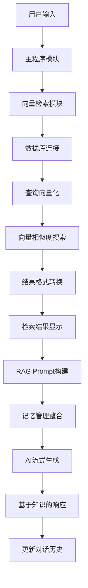

# 06_rag - 基础RAG实现

## 概述
实现了检索增强生成（RAG）系统，使AI能够基于知识库内容回答问题。这是从通用聊天助手向专业知识助手的重大升级。

## 目录结构
```
06_rag/
├── chat_rag.js          # 主程序：RAG增强聊天助手
├── rag_search.js        # 核心：向量检索模块
├── chat_rag_backup.js   # 备份版本
├── test_rag.js          # 测试脚本
├── test_db.js          # 数据库测试
└── test.md             # 测试文档
```

## 核心模块

### 1. 向量检索模块 (rag_search.js)

#### 数据库连接子模块
```javascript
export async function initDB() {
  db = await connect(dbPath);
  table = await db.openTable("knowledge_vectors");
  if (!table) {
    throw new Error("❌ LanceDB 知识库不存在，请先运行 embed.js");
  }
}
```
- **功能**：连接LanceDB向量数据库
- **依赖**：需要先运行`embed.js`构建知识库
- **错误处理**：数据库不存在时给出明确提示

#### 向量搜索子模块
```javascript
export async function search(query, topK = 3) {
  if (!table) throw new Error("数据库未初始化");

  // 生成查询向量
  const embeddings = new OllamaEmbeddings({ model: "nomic-embed-text" });
  const queryVec = await embeddings.embedQuery(query);

  // 向量相似度搜索
  const results = await table.search(queryVec, { vectorColumnName: "vector" })
    .limit(topK)
    .toArray();

  // 格式转换
  return results.map(item => ({
    file: item.source,
    text: item.text,
    score: item._distance !== undefined ? 1 / (1 + item._distance) : 0
  }));
}
```
- **流程**：文本 → 向量 → 相似度搜索 → 结果转换
- **嵌入模型**：使用`nomic-embed-text`生成向量
- **相似度计算**：将距离转换为0-1的相似度分数

### 2. 主程序模块 (chat_rag.js)

#### 配置常量模块
```javascript
const C = {
  dim: "\x1b[2m",
  yellow: "\x1b[33m",
  green: "\x1b[32m",
  cyan: "\x1b[36m",
  magenta: "\x1b[35m",
  reset: "\x1b[0m",
};
```
- **功能**：颜色定义，继承05版本的界面美化

#### RAG Prompt模板模块
```javascript
const prompt = ChatPromptTemplate.fromMessages([
  ["system", "你是一个 AI 助手，会根据知识库内容进行回答。"],
  ["placeholder", "{history}"],
  [
    "human",
    `用户问题：{input}
检索到的知识：
{docs}

请结合知识库内容回答用户问题。如果知识库中没有相关信息，请如实说明。`,
  ],
]);
```
- **特点**：专门为RAG设计的prompt模板
- **结构**：系统指令 + 历史 + 问题 + 检索知识
- **要求**：明确要求基于知识库回答

#### RAG响应处理模块
```javascript
async function getAIResponse(query, docs, sessionId) {
  console.log(C.green + "🤖 AI：" + C.reset);

  const stream = await chat.stream(
    { input: query, docs: docs },
    { configurable: { sessionId } }
  );

  let response = "";
  for await (const chunk of stream) {
    if (chunk?.content) {
      process.stdout.write(chunk.content);
      response += chunk.content;
    }
  }

  return response;
}
```
- **功能**：整合检索结果和AI生成
- **输入**：用户问题 + 检索到的文档
- **输出**：基于知识库的流式响应

#### 检索结果显示模块
```javascript
// 格式化检索结果
const docList =
  results.length > 0
    ? results.map((r, idx) => `【${idx + 1}】${r.text.substring(0, 150)}...`).join("\n\n")
    : "（未检索到相关知识）";

console.log(C.green + "🔍 检索结果：" + C.reset);
console.log(docList);
line();
```
- **功能**：显示检索到的相关内容
- **格式**：编号 + 文本预览（前150字符）
- **可视化**：明确展示AI将基于哪些信息回答

## 模块交互图



## RAG处理流程

### 1. 检索阶段
```
用户问题："公司的开发规范是什么？"
↓
向量化查询："公司的开发规范是什么？" → [0.1, 0.2, -0.3, ...]
↓
向量搜索：在知识库中查找最相似的3个文档
↓
检索结果：
【1】公司开发规范要求所有代码必须经过Code Review...
【2】项目提交前需要完成单元测试，覆盖率需达到80%以上...
【3】文档编写规范：使用Markdown格式，包含必要的说明...
```

### 2. 生成阶段
```
Prompt模板填充：
系统：你是一个 AI 助手，会根据知识库内容进行回答。
历史：{对话历史}
用户问题：公司的开发规范是什么？
检索到的知识：【1】公司开发规范要求...【2】项目提交前需要...【3】文档编写规范...
↓
AI基于检索到的知识生成回答：
根据公司开发规范，主要要求包括：1. 所有代码必须经过Code Review...
```

## 知识库结构

### 向量数据库表结构
```javascript
// knowledge_vectors表结构
{
  vector: [0.1, 0.2, ...],      // 768维向量
  text: "公司开发规范要求...",   // 原始文本
  source: "dev_guide.md",       // 来源文件
  metadata: {...}               // 元数据
}
```

### 检索结果格式
```javascript
{
  file: "dev_guide.md",         // 来源文件
  text: "公司开发规范要求...",   // 匹配文本
  score: 0.85                   // 相似度分数（0-1）
}
```

## 与之前版本的对比

| 特性 | 05_terminal_chat_ui.js | 06_rag/chat_rag.js |
|------|------------------------|---------------------|
| 知识来源 | 模型预训练知识 | 外部知识库检索 |
| 准确性 | 通用知识 | 专业领域知识 |
| 可定制性 | 低 | 高（可扩展知识库） |
| 实时性 | 静态知识 | 可更新知识库 |
| 架构复杂度 | 简单 | 中等（增加检索层） |

## 关键技术

### 1. 向量相似度搜索
- **嵌入模型**：Ollama的nomic-embed-text
- **向量维度**：通常768或1536维
- **相似度算法**：余弦相似度或欧氏距离
- **Top-K检索**：返回最相似的K个结果

### 2. 提示工程优化
```javascript
// 关键prompt设计
`请结合知识库内容回答用户问题。如果知识库中没有相关信息，请如实说明。`
```
- **明确指令**：要求基于检索内容回答
- **降级策略**：知识不足时诚实说明
- **引用要求**：鼓励引用具体知识片段

### 3. 错误处理链
```javascript
try {
  results = await search(userInput, 3);
} catch (searchError) {
  console.error(C.magenta + "❌ 检索失败: " + searchError.message + C.reset);
  line();
  continue;
}
```
- **检索失败**：不影响后续对话
- **友好提示**：彩色错误信息
- **流程继续**：跳过当前检索继续循环

## 测试用例

**知识库内容**：
```
公司开发规范：
1. 代码必须经过Code Review
2. 单元测试覆盖率需达到80%
3. 使用Git进行版本控制
```

**用户查询**：
```
🧑 你：代码审查有什么要求？
🔍 检索结果：
【1】公司开发规范要求所有代码必须经过Code Review，至少需要一名高级工程师审核...

🤖 AI：根据公司开发规范，代码审查要求包括：1. 所有代码必须经过Code Review...
```

## 扩展方向

### 1. 检索策略优化
- 混合检索（关键词+向量）
- 重排序（Re-ranking）
- 查询扩展（Query Expansion）

### 2. 知识库管理
- 增量更新
- 版本控制
- 质量评估

### 3. 回答质量提升
- 引用标注（显示引用来源）
- 置信度评分
- 多源验证

## 实际应用价值

1. **企业知识助手**：公司制度、规范查询
2. **技术支持**：产品文档、故障排查
3. **教育工具**：课程资料、学习指导
4. **客服系统**：常见问题解答

## 版本演进意义

这是课程的第七课，实现了质的飞跃：
- **知识外部化**：从模型内部知识到外部知识库
- **专业化**：从通用聊天到领域专家
- **可扩展性**：知识库可随时更新扩展
- **准确性**：基于真实文档，回答更准确

## 注意事项

1. **知识库质量**：检索效果依赖知识库质量
2. **向量化成本**：需要额外的嵌入模型计算
3. **检索延迟**：比直接生成略慢
4. **知识覆盖**：可能遇到知识库未覆盖的问题