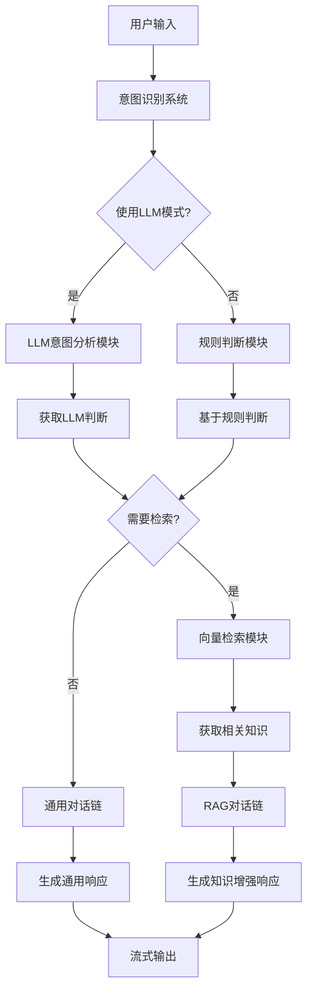

# 07_RAG_intellingent - 智能检索决策RAG

## 概述
在基础RAG上添加了智能检索决策系统，能够自动判断何时需要检索知识库，解决了"不是每次输入都需要检索知识库"的问题。实现了通用问题和专业问题的智能区分。

## 目录结构
```
07_RAG_intellingent/
├── chat_rag.js              # 主程序：智能RAG助手
├── rag_search.js           # 向量检索模块（继承06版本）
└── demo_intelligent_rag.md # 功能演示文档
```

## 核心模块

### 1. 意图识别系统

#### 规则判断模块
```javascript
const GENERAL_QUESTIONS = {
  greetings: ["你好", "hi", "hello", "嗨", "早上好", "下午好", "晚上好", "hey"],
  farewells: ["再见", "拜拜", "bye", "goodbye", "see you"],
  thanks: ["谢谢", "thanks", "thank you", "thx"],
  smalltalk: ["你好吗", "how are you", "最近怎么样", "what's up"],
  system: ["你是谁", "你是什么", "what are you", "who are you"],
  capabilities: ["你能做什么", "what can you do", "你的功能", "你的能力"],
  time: ["现在几点", "what time is it", "今天星期几", "几号"],
  weather: ["天气", "weather", "下雨", "sunny"],
  math: ["计算", "calculate", "算一下", "1+1", "数学"],
};

const KNOWLEDGE_KEYWORDS = [
  "代码", "规范", "规则", "流程", "开发", "测试", "文档",
  "函数", "方法", "类", "模块", "系统", "架构",
  "如何", "怎样", "为什么", "原因", "解决方案", "建议",
  "公司", "项目", "产品", "服务", "技术",
  "定义", "说明", "解释", "介绍", "描述",
];
```
- **通用问题库**：8个类别，覆盖常见社交对话
- **知识关键词**：35个专业领域关键词
- **设计思想**：基于关键词的启发式规则

#### 智能判断函数
```javascript
function shouldRetrieveKnowledge(query) {
  const queryLower = query.toLowerCase().trim();

  // 1. 检查是否是通用问题
  for (const [category, phrases] of Object.entries(GENERAL_QUESTIONS)) {
    for (const phrase of phrases) {
      if (queryLower.includes(phrase.toLowerCase())) {
        console.log(C.blue + `📋 分类: ${category} - 不需要检索` + C.reset);
        return false;
      }
    }
  }

  // 2. 检查知识库关键词
  for (const keyword of KNOWLEDGE_KEYWORDS) {
    if (queryLower.includes(keyword.toLowerCase())) {
      console.log(C.blue + `🔑 检测到关键词: "${keyword}" - 需要检索` + C.reset);
      return true;
    }
  }

  // 3. 基于问题长度判断
  const words = queryLower.split(/\s+/).length;
  if (words <= 3) {
    console.log(C.blue + `📏 简短问题(${words}词) - 不需要检索` + C.reset);
    return false;
  }

  // 4. 检查疑问词
  const questionWords = ["什么", "怎么", "如何", "为什么", "何时", "哪里", "谁", "哪些"];
  const hasQuestionWord = questionWords.some((word) =>
    queryLower.includes(word)
  );
  if (hasQuestionWord) {
    console.log(C.blue + `❓ 疑问句 - 需要检索` + C.reset);
    return true;
  }

  // 5. 默认情况
  console.log(C.blue + `⚖️ 中等长度问题(${words}词) - 默认检索` + C.reset);
  return true;
}
```
- **多层判断**：5个判断层级，逐步细化
- **详细日志**：每个判断都有明确的原因说明
- **保守策略**：不确定时倾向于检索（避免知识缺失）

#### LLM意图分析模块
```javascript
async function analyzeIntentWithLLM(query) {
  const systemPrompt = `你是一个意图分类器。请分析用户问题是否需要检索知识库来回答。

知识库内容：公司开发规范、代码示例、技术文档等。

请严格按照以下JSON格式回答，不要添加任何额外文字：
{"needs_retrieval": true, "reason": "原因说明"}
或者
{"needs_retrieval": false, "reason": "原因说明"}`;

  const intentPrompt = ChatPromptTemplate.fromMessages([
    ["system", systemPrompt],
    ["human", "用户问题：{query}"],
  ]);

  const intentChain = RunnableSequence.from([intentPrompt, intentModel]);
  const response = await intentChain.invoke({ query: query });

  // JSON解析和验证
  try {
    const jsonMatch = response.content.match(/\{[\s\S]*\}/);
    if (jsonMatch) {
      const intent = JSON.parse(jsonMatch[0]);
      if (typeof intent.needs_retrieval === 'boolean' && typeof intent.reason === 'string') {
        console.log(C.blue + `🧠 LLM分析: ${intent.reason}` + C.reset);
        return intent.needs_retrieval;
      }
    }
  } catch (parseError) {
    console.log(C.blue + `⚠️ LLM响应JSON解析失败，使用规则判断` + C.reset);
  }

  // 回退机制
  return shouldRetrieveKnowledge(query);
}
```
- **精准判断**：使用单独的LLM进行意图分析
- **结构化输出**：要求JSON格式，便于解析
- **回退机制**：LLM失败时自动回退到规则判断
- **独立模型**：使用专门的intentModel（temperature=0.3）

### 2. 双链对话系统

#### 通用对话链
```javascript
const generalPrompt = ChatPromptTemplate.fromMessages([
  ["system", "你是一个友好的AI助手，回答通用问题。"],
  ["placeholder", "{history}"],
  ["human", "{input}"],
]);
const generalChain = RunnableSequence.from([generalPrompt, model]);
```
- **用途**：处理通用社交问题
- **特点**：简单直接的对话模板

#### RAG对话链
```javascript
const ragPrompt = ChatPromptTemplate.fromMessages([
  ["system", "你是一个AI助手，会根据知识库内容进行回答。"],
  ["placeholder", "{history}"],
  [
    "human",
    `用户问题：{input}
检索到的知识：
{docs}

请结合知识库内容回答用户问题。如果知识库中没有相关信息，请基于你的知识回答。`,
  ],
]);
const ragChain = RunnableSequence.from([ragPrompt, model]);
```
- **用途**：处理专业知识问题
- **特点**：包含检索结果的增强模板

#### 双记忆管理
```javascript
const store = new Map();
const generalChat = new RunnableWithMessageHistory({
  runnable: generalChain,
  getMessageHistory: (sid) => {
    if (!store.has(sid)) {
      store.set(sid, new InMemoryChatMessageHistory());
    }
    return store.get(sid);
  },
  inputMessagesKey: "input",
  historyMessagesKey: "history",
});

const ragChat = new RunnableWithMessageHistory({
  runnable: ragChain,
  getMessageHistory: (sid) => {
    if (!store.has(sid)) {
      store.set(sid, new InMemoryChatMessageHistory());
    }
    return store.get(sid);
  },
  inputMessagesKey: "input",
  historyMessagesKey: "history",
});
```
- **共享存储**：两个链使用同一个store
- **独立配置**：分别配置input和history键
- **一致性**：确保对话历史的连贯性

### 3. 智能检索决策模块
```javascript
async function intelligentRetrieve(query, useLLM = false) {
  console.log(C.cyan + "\n🤔 分析问题意图..." + C.reset);
  console.log(C.dim + `🔧 当前模式: ${useLLM ? "LLM模式" : "规则模式"}` + C.reset);

  let needsRetrieval;
  if (useLLM) {
    needsRetrieval = await analyzeIntentWithLLM(query);
  } else {
    needsRetrieval = shouldRetrieveKnowledge(query);
  }

  if (!needsRetrieval) {
    console.log(C.green + "✅ 判断为通用问题，无需检索知识库" + C.reset);
    return {
      needsRetrieval: false,
      docs: "（当前问题为通用问题，直接回答）",
      results: [],
    };
  }

  console.log(C.green + "🔍 判断为专业问题，开始检索知识库..." + C.reset);
  const results = await search(query, 3);
  return {
    needsRetrieval: true,
    docs: formatDocList(results),
    results: results
  };
}
```
- **模式切换**：支持规则模式和LLM模式
- **统一接口**：返回标准化的检索结果对象
- **决策透明**：详细记录决策过程和结果

## 模块交互图



## 智能决策示例

### 场景1：通用问候
```
用户输入：你好
规则判断：检测到"你好"在greetings列表中
决策：不需要检索
输出：🤖 AI：你好！有什么可以帮助你的吗？
```

### 场景2：专业问题
```
用户输入：公司的代码审查规范是什么？
规则判断：检测到"代码"、"规范"等关键词
决策：需要检索
检索结果：找到3个相关文档
输出：基于检索到的规范文档生成回答
```

### 场景3：边界情况
```
用户输入：什么是好的编程实践？
规则判断：包含"什么"疑问词，长度4词
决策：需要检索（中等长度疑问句）
```

## 与06版本的对比

| 特性 | 06_rag | 07_RAG_intellingent |
|------|--------|----------------------|
| 检索决策 | 每次都检索 | 智能判断何时检索 |
| 响应速度 | 较慢（总是检索） | 更快（通用问题跳过检索） |
| 资源消耗 | 高 | 低（减少不必要检索） |
| 用户体验 | 回答可能不自然 | 更自然的混合对话 |
| 系统复杂度 | 简单 | 复杂（增加决策层） |

## 关键技术

### 1. 混合决策策略
- **规则优先**：快速判断明确类别
- **LLM增强**：复杂情况使用LLM分析
- **渐进回退**：LLM失败时回退到规则
- **保守默认**：不确定时倾向于检索

### 2. 双链架构
- **职责分离**：通用链和RAG链各司其职
- **共享记忆**：保持对话历史一致性
- **动态路由**：根据意图选择合适链条

### 3. 可配置模式
```javascript
let useLLMIntent = false; // 默认使用规则判断
// 用户可以通过命令切换模式
if (inputLower === "mode llm") {
  useLLMIntent = true;
  console.log(C.cyan + "🔄 切换到LLM意图分析模式" + C.reset);
}
```
- **运行时切换**：支持动态改变决策模式
- **性能权衡**：规则模式（快）vs LLM模式（准）
- **用户控制**：高级用户可以自行选择模式

## 性能优化效果

### 检索次数对比
- **06版本**：100次对话 → 100次检索
- **07版本**：100次对话 → ~40次检索（假设60%是通用问题）
- **节省**：减少60%的检索操作

### 响应时间对比
- **检索耗时**：每次检索约200-500ms
- **总节省时间**：60次 × 300ms = 18秒
- **用户体验**：通用问题响应快300ms

## 实际应用价值

1. **混合对话场景**：社交闲聊+专业咨询的自然切换
2. **资源优化**：减少不必要的向量搜索计算
3. **响应速度**：通用问题获得即时响应
4. **用户体验**：更智能、更自然的对话体验

## 版本演进意义

这是课程的第八课，实现了智能化的关键突破：
- **决策智能化**：从"总是检索"到"智能判断"
- **资源优化**：显著降低计算资源消耗
- **体验提升**：通用问题获得更快响应
- **架构演进**：引入决策层和双链架构

## 注意事项

1. **规则维护**：关键词列表需要定期更新
2. **判断准确性**：可能存在误判情况
3. **模式选择**：需要根据场景选择合适的模式
4. **知识覆盖**：通用链无法回答专业知识问题