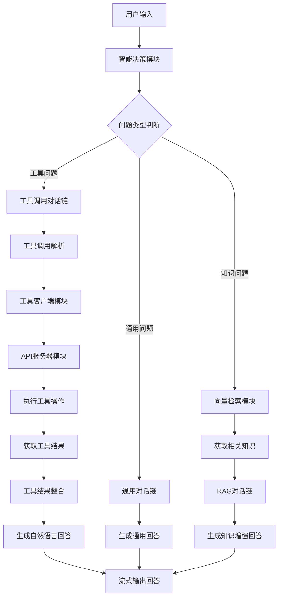

# 08_RAG_tools - 工具调用集成

## 概述
在智能RAG基础上集成了工具调用（Function Calling）功能，使AI能够执行外部操作，如查询数据、执行计算、获取系统状态等。实现了对话系统与外部服务的连接。

## 目录结构
```
08_RAG_tools/
├── chat_rag_tools.js       # 主程序：工具调用RAG助手
├── api_server.js          # Mock API服务器
├── tools_client.js        # 工具调用客户端
├── rag_search.js          # 向量检索模块
├── lib/                   # 工具库目录
├── test/                  # 测试目录
└── README.md             # 说明文档
```

## 核心模块

### 1. API服务器模块 (api_server.js)

#### 工具端点定义
```javascript
// 用户管理工具
app.get('/api/users', (req, res) => {
  const { search, limit = 10 } = req.query;
  let users = sampleUsers;

  if (search) {
    users = users.filter(u =>
      u.name.includes(search) ||
      u.email.includes(search) ||
      u.department.includes(search)
    );
  }

  res.json({
    success: true,
    count: users.length,
    data: users.slice(0, parseInt(limit)),
    message: `找到 ${users.length} 个用户`
  });
});

// 项目管理工具
app.get('/api/projects', (req, res) => {
  res.json({
    success: true,
    count: sampleProjects.length,
    data: sampleProjects,
    message: '项目列表获取成功'
  });
});

// 计算工具
app.post('/api/calculate', express.json(), (req, res) => {
  const { expression } = req.body;
  try {
    const result = evalExpression(expression);
    res.json({
      success: true,
      data: { expression, result },
      message: `计算成功: ${expression} = ${result}`
    });
  } catch (error) {
    res.status(400).json({
      success: false,
      error: error.message,
      message: '计算表达式无效'
    });
  }
});
```
- **RESTful设计**：标准HTTP接口设计
- **错误处理**：统一的错误响应格式
- **数据模拟**：提供模拟数据供测试使用
- **安全计算**：使用安全的表达式计算库

### 2. 工具客户端模块 (tools_client.js)

#### 工具定义与健康检查
```javascript
const TOOL_DEFINITIONS = [
  {
    function: {
      name: "get_users",
      description: "获取用户信息列表",
      parameters: {
        type: "object",
        properties: {
          search: { type: "string", description: "搜索关键词（姓名、邮箱、部门）" },
          limit: { type: "number", description: "返回数量限制" }
        }
      }
    }
  },
  // ... 其他工具定义
];

export async function checkServerHealth() {
  try {
    const response = await fetch(`${API_BASE}/health`, { timeout: 3000 });
    const data = await response.json();
    return { available: true, status: data.status, version: data.version };
  } catch (error) {
    return { available: false, error: error.message };
  }
}
```
- **结构化定义**：OpenAI兼容的工具定义格式
- **健康检查**：启动时验证API服务器可用性
- **超时控制**：避免长时间等待

#### 工具执行器
```javascript
export async function executeTool(toolName, parameters = {}) {
  try {
    let response;

    switch (toolName) {
      case 'get_users':
        response = await fetch(`${API_BASE}/users?${new URLSearchParams(parameters)}`);
        break;
      case 'calculate':
        response = await fetch(`${API_BASE}/calculate`, {
          method: 'POST',
          headers: { 'Content-Type': 'application/json' },
          body: JSON.stringify(parameters)
        });
        break;
      // ... 其他工具分支
    }

    return await response.json();
  } catch (error) {
    return {
      success: false,
      error: error.message,
      message: `工具调用失败: ${error.message}`
    };
  }
}
```
- **统一接口**：所有工具通过相同函数调用
- **错误处理**：统一的异常捕获和返回格式
- **参数传递**：支持不同工具的参数结构

### 3. 智能决策模块增强

#### 工具关键词扩展
```javascript
const TOOLS_KEYWORDS = {
  users: ["用户", "员工", "同事", "成员", "人员", "team", "staff"],
  projects: ["项目", "工程", "任务", "project", "task", "工作"],
  company: ["公司", "企业", "组织", "机构", "company", "organization"],
  calculations: ["计算", "算", "等于", "结果", "calculate", "compute"],
  conversions: ["转换", "换算", "温度", "长度", "货币", "convert", "exchange"],
  system: ["状态", "运行", "系统", "服务", "status", "system"],
};
```
- **语义分类**：按功能领域分类关键词
- **中英支持**：同时支持中文和英文关键词
- **扩展性**：易于添加新的工具类别

#### 三路决策系统
```javascript
function analyzeQuestionType(query) {
  const queryLower = query.toLowerCase().trim();

  // 1. 检查通用问题
  for (const [category, phrases] of Object.entries(GENERAL_QUESTIONS)) {
    for (const phrase of phrases) {
      if (queryLower.includes(phrase.toLowerCase())) {
        return { type: 'general', category, needsRetrieval: false, needsTools: false };
      }
    }
  }

  // 2. 检查工具调用
  const neededTools = [];
  for (const [toolCategory, keywords] of Object.entries(TOOLS_KEYWORDS)) {
    for (const keyword of keywords) {
      if (queryLower.includes(keyword.toLowerCase())) {
        neededTools.push(toolCategory);
        break;
      }
    }
  }

  if (neededTools.length > 0) {
    return {
      type: 'tools',
      tools: neededTools,
      needsRetrieval: false,
      needsTools: true
    };
  }

  // 3. 检查知识库检索
  for (const keyword of KNOWLEDGE_KEYWORDS) {
    if (queryLower.includes(keyword.toLowerCase())) {
      return { type: 'knowledge', needsRetrieval: true, needsTools: false };
    }
  }

  // 4. 默认：通用问题
  return { type: 'general', needsRetrieval: false, needsTools: false };
}
```
- **优先级**：通用 → 工具 → 知识库
- **多工具支持**：可能同时需要多个工具
- **明确分类**：返回详细的分类信息

### 4. 工具调用对话链

#### 工具专用Prompt
```javascript
const toolsPrompt = ChatPromptTemplate.fromMessages([
  ["system", `你是一个AI助手，可以调用工具来获取信息或执行操作。

可用工具：
- get_users: 获取用户信息
- get_projects: 获取项目信息
- get_tasks: 获取任务信息
- get_company_info: 获取公司信息
- calculate: 执行数学计算
- convert_units: 单位转换
- get_system_status: 获取系统状态

请根据用户问题决定是否需要调用工具，如果需要，请使用正确的工具和参数。`],
  ["placeholder", "{history}"],
  ["human", "{input}"],
]);
```
- **工具清单**：明确列出可用工具
- **使用说明**：指导AI如何选择和使用工具
- **结构化设计**：便于AI理解和执行

#### 工具调用解析器
```javascript
function parseToolCall(response) {
  if (!response.content) return null;

  const content = response.content.toLowerCase();
  const toolPatterns = [
    { tool: 'get_users', patterns: ['用户', '员工', '同事', '人员', '名单'] },
    { tool: 'get_projects', patterns: ['项目', '工程', '任务', '进度', '状态'] },
    { tool: 'get_tasks', patterns: ['任务', '待办', '工作', '分配'] },
    { tool: 'get_company_info', patterns: ['公司', '企业', '组织', '信息'] },
    { tool: 'calculate', patterns: ['计算', '等于', '结果', '算一下'] },
    { tool: 'convert_units', patterns: ['转换', '换算', '温度', '长度', '货币'] },
    { tool: 'get_system_status', patterns: ['状态', '运行', '系统', '服务'] },
  ];

  for (const { tool, patterns } of toolPatterns) {
    for (const pattern of patterns) {
      if (content.includes(pattern)) {
        return {
          tool,
          parameters: extractParameters(content, tool)
        };
      }
    }
  }

  return null;
}
```
- **关键词匹配**：基于内容识别工具调用意图
- **参数提取**：从文本中提取工具参数
- **容错设计**：匹配失败时返回null

### 5. 工具结果整合模块

#### 结果总结生成
```javascript
async function generateToolSummary(query, toolResult) {
  const summaryPrompt = ChatPromptTemplate.fromMessages([
    ["system", "你是一个AI助手，需要根据工具执行结果回答用户问题。"],
    ["human", `用户问题：${query}

工具执行结果：
${JSON.stringify(toolResult.data, null, 2)}

请基于以上结果，用自然语言回答用户的问题。`],
  ]);

  const summaryChain = RunnableSequence.from([summaryPrompt, model]);
  const response = await summaryChain.invoke({});

  return response.content || "无法生成总结";
}
```
- **自然语言转换**：将工具数据转换为友好回答
- **上下文保持**：基于原始用户问题生成回答
- **数据整合**：将工具结果整合到对话流中

## 模块交互图



## 工具调用流程示例

### 场景：查询用户信息
```
用户输入：有哪些用户？
↓
决策：检测到"用户"关键词 → 工具类型
↓
工具链响应：我需要调用get_users工具来获取用户信息
↓
工具解析：识别get_users工具，提取参数{}
↓
工具执行：调用API GET /api/users
↓
工具结果：{success: true, data: [...], count: 5}
↓
结果整合：基于数据生成自然语言回答
↓
最终输出：目前系统中有5个用户：张三（开发部）、李四（测试部）...
```

### 场景：数学计算
```
用户输入：计算2+3*4
↓
决策：检测到"计算"关键词 → 工具类型
↓
工具链响应：我需要调用calculate工具
↓
参数提取：expression="2+3*4"
↓
工具执行：调用API POST /api/calculate {expression: "2+3*4"}
↓
工具结果：{success: true, data: {expression: "2+3*4", result: 14}}
↓
结果整合：2+3*4的计算结果是14
```

## 与07版本的对比

| 特性 | 07_RAG_intellingent | 08_RAG_tools |
|------|----------------------|---------------|
| 能力范围 | 回答知识问题 | 回答+执行操作 |
| 系统架构 | 双链（通用+RAG） | 三链（+工具链） |
| 外部集成 | 无 | 集成API服务器 |
| 功能扩展 | 静态知识 | 动态数据+计算 |
| 实用性 | 信息查询 | 完整助手功能 |

## 关键技术

### 1. 三链路由架构
- **职责清晰**：每个链条处理特定类型问题
- **动态选择**：基于意图分析自动路由
- **共享记忆**：保持对话历史一致性
- **可扩展性**：易于添加新的处理链条

### 2. 工具调用范式
- **声明式定义**：结构化工具描述
- **意图识别**：从自然语言到工具调用
- **参数提取**：上下文参数自动提取
- **结果整合**：工具数据转自然语言

### 3. API集成模式
- **松耦合**：通过HTTP API集成外部服务
- **模拟数据**：开发阶段使用模拟数据
- **错误隔离**：工具失败不影响整体系统
- **服务发现**：健康检查确保依赖可用

## 工具生态系统

### 已实现工具
1. **数据查询类**
   - 用户管理：查询、搜索用户信息
   - 项目管理：获取项目列表和状态
   - 任务管理：查看任务分配

2. **计算类**
   - 数学计算：表达式求值
   - 单位转换：温度、长度、货币转换

3. **系统类**
   - 系统状态：服务健康检查
   - 公司信息：组织架构查询

### 扩展模式
```javascript
// 添加新工具的步骤：
// 1. 在api_server.js中添加API端点
// 2. 在tools_client.js中添加工具定义和执行逻辑
// 3. 在TOOLS_KEYWORDS中添加识别关键词
// 4. 在toolsPrompt中更新工具列表
```

## 实际应用价值

1. **企业助手**：员工信息查询、项目状态跟踪
2. **技术支持**：系统诊断、数据查询
3. **个人助手**：计算、转换、信息查询
4. **开发原型**：快速验证工具调用概念

## 版本演进意义

这是课程的第九课，实现了能力的重大扩展：
- **从回答到执行**：不仅回答问题，还能执行操作
- **外部系统集成**：连接数据库、计算服务等外部系统
- **完整助手能力**：接近商业智能助手的完整功能
- **架构成熟度**：成熟的三链路由架构

## 注意事项

1. **API可用性**：依赖外部服务的稳定性
2. **工具安全性**：需要控制工具的执行权限
3. **参数准确性**：自然语言到参数提取可能不准确
4. **错误处理**：工具调用失败需要优雅降级