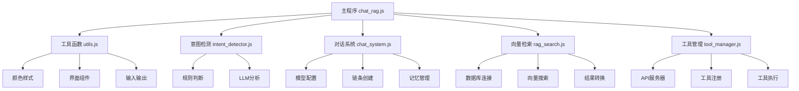

# 09_RAG_Tools - 模块化智能工具调用RAG助手

## 概述
在前几版的基础上进行了全面的模块化重构，将系统拆分为独立的、可复用的模块。这是课程的最新版本，实现了高度模块化、可维护的智能RAG助手系统。

## 目录结构
```
09_RAG_Tools/
├── chat_rag.js              # 主程序：模块化整合
├── tool_manager.js          # 工具管理核心模块
├── api_server.js           # Mock API服务器
├── chat_system.js          # 对话系统模块
├── intent_detector.js      # 意图检测模块
├── rag_search.js           # 向量检索模块
├── utils.js               # 工具函数模块
├── README.md              # 详细说明文档
└── test_modular.js        # 模块化测试
```

## 模块化架构设计

### 1. 工具函数模块 (utils.js)

#### 颜色和样式管理
```javascript
export const C = {
  dim: "\x1b[2m",
  yellow: "\x1b[33m",
  green: "\x1b[32m",
  cyan: "\x1b[36m",
  magenta: "\x1b[35m",
  blue: "\x1b[34m",
  red: "\x1b[31m",
  reset: "\x1b[0m",
};
```

#### 界面组件函数
```javascript
export function line() {
  console.log(C.dim + "──────────────────────────────────────────────" + C.reset);
}

export function printSection(title) {
  console.log(C.cyan + `\n${title}` + C.reset);
  line();
}

export function printInfo(message) {
  console.log(C.blue + message + C.reset);
}

export function printSuccess(message) {
  console.log(C.green + message + C.reset);
}
```
- **可复用组件**：所有界面元素都模块化
- **统一风格**：确保整个系统界面一致性
- **易于维护**：修改样式只需改一处

#### 输入输出工具
```javascript
let rl = null;

export function createReadline() {
  if (!rl) {
    rl = readline.createInterface({
      input: process.stdin,
      output: process.stdout,
    });
  }
  return rl;
}

export async function askQuestion(question) {
  const rlInstance = createReadline();
  return new Promise((resolve) => {
    rlInstance.question(C.yellow + question + C.reset, resolve);
  });
}
```
- **单例模式**：确保只有一个readline实例
- **Promise封装**：简化异步输入处理
- **颜色集成**：输入提示自动着色

### 2. 意图检测模块 (intent_detector.js)

#### 智能检索决策函数
```javascript
export async function intelligentRetrieve(query, useLLM = false) {
  printDebug(`分析问题意图...`);
  printDebug(`当前模式: ${useLLM ? "LLM模式" : "规则模式"}`);

  let needsRetrieval;
  if (useLLM) {
    needsRetrieval = await analyzeIntentWithLLM(query);
  } else {
    needsRetrieval = shouldRetrieveKnowledge(query);
  }

  if (!needsRetrieval) {
    printSuccess("判断为通用问题，无需检索知识库");
    return {
      needsRetrieval: false,
      needsTool: false,
      docs: "（当前问题为通用问题，直接回答）",
    };
  }

  printSuccess("判断为专业问题，需要检索知识库");
  return {
    needsRetrieval: true,
    needsTool: false,
    docs: null, // 由主程序填充检索结果
  };
}
```
- **标准化输出**：使用统一的打印函数
- **清晰接口**：返回标准化的决策结果
- **职责分离**：只负责决策，不执行检索

### 3. 对话系统模块 (chat_system.js)

#### 链条创建函数
```javascript
export function createChains() {
  // 通用对话链
  const generalPrompt = ChatPromptTemplate.fromMessages([
    ["system", "你是一个友好的AI助手，回答通用问题。"],
    ["placeholder", "{history}"],
    ["human", "{input}"],
  ]);
  const generalChain = RunnableSequence.from([generalPrompt, model]);

  // RAG对话链
  const ragPrompt = ChatPromptTemplate.fromMessages([
    ["system", "你是一个AI助手，会根据知识库内容进行回答。"],
    ["placeholder", "{history}"],
    [
      "human",
      `用户问题：{input}
检索到的知识：
{docs}

请结合知识库内容回答用户问题。如果知识库中没有相关信息，请基于你的知识回答。`,
    ],
  ]);
  const ragChain = RunnableSequence.from([ragPrompt, model]);

  return { generalChain, ragChain };
}
```
- **工厂模式**：集中创建所有对话链条
- **配置集中**：所有prompt模板集中管理
- **易于扩展**：添加新链条只需修改此函数

#### 记忆管理工厂
```javascript
export function createChatWithHistory(generalChain, ragChain) {
  const store = new Map();

  const getMessageHistory = (sid) => {
    if (!store.has(sid)) {
      store.set(sid, new InMemoryChatMessageHistory());
    }
    return store.get(sid);
  };

  const generalChat = new RunnableWithMessageHistory({
    runnable: generalChain,
    getMessageHistory,
    inputMessagesKey: "input",
    historyMessagesKey: "history",
  });

  const ragChat = new RunnableWithMessageHistory({
    runnable: ragChain,
    getMessageHistory,
    inputMessagesKey: "input",
    historyMessagesKey: "history",
  });

  return { generalChat, ragChat };
}
```
- **共享存储**：所有链条使用同一记忆存储
- **统一接口**：标准化的记忆管理接口
- **内存优化**：避免重复创建存储实例

### 4. 工具管理模块 (tool_manager.js)

#### 工具注册系统
```javascript
class ToolManager {
  constructor() {
    this.tools = new Map();
    this.apiBase = "http://localhost:3000/api";
  }

  registerTool(name, definition, executor) {
    this.tools.set(name, { definition, executor });
    printSuccess(`✅ 注册工具: ${name}`);
  }

  async executeTool(name, params = {}) {
    const tool = this.tools.get(name);
    if (!tool) {
      throw new Error(`工具未注册: ${name}`);
    }

    try {
      const result = await tool.executor(params);
      printSuccess(`🛠️ 工具执行成功: ${name}`);
      return { success: true, ...result };
    } catch (error) {
      printError(`❌ 工具执行失败: ${error.message}`);
      return { success: false, error: error.message };
    }
  }

  getToolDefinitions() {
    return Array.from(this.tools.values()).map(t => t.definition);
  }
}
```
- **类封装**：面向对象的设计
- **动态注册**：运行时注册新工具
- **统一管理**：集中管理所有工具

#### 工具执行器封装
```javascript
// 用户查询工具
toolManager.registerTool(
  "get_users",
  {
    function: {
      name: "get_users",
      description: "获取用户信息列表",
      parameters: {
        type: "object",
        properties: {
          search: { type: "string", description: "搜索关键词" },
          limit: { type: "number", description: "返回数量限制" }
        }
      }
    }
  },
  async (params) => {
    const response = await fetch(`${apiBase}/users?${new URLSearchParams(params)}`);
    return await response.json();
  }
);
```

### 5. 主程序模块 (chat_rag.js)

#### 精简主函数
```javascript
async function main() {
  // 1. 显示欢迎信息
  printWelcome();

  // 2. 加载知识库
  try {
    console.log("正在加载知识库...");
    await initDB();
    printSuccess("✅ 知识库加载成功");
  } catch (error) {
    printError(`❌ 知识库加载失败: ${error.message}`);
    console.log("请先运行 embed.js 构建知识库");
    closeReadline();
    process.exit(1);
  }

  // 3. 显示使用说明
  printUsage();

  // 4. 初始化对话系统
  const { generalChain, ragChain } = createChains();
  const chatInstances = createChatWithHistory(generalChain, ragChain);

  // 5. 进入主循环
  let useLLMIntent = DEFAULT_MODE;
  await mainLoop(useLLMIntent, chatInstances);

  // 6. 清理和退出
  closeReadline();
  printSuccess("\n🎉 感谢使用智能RAG助手！");
}
```
- **清晰流程**：六步标准流程
- **错误隔离**：每个步骤独立错误处理
- **资源管理**：确保正确清理资源

#### 主循环抽象
```javascript
async function mainLoop(useLLMIntent, chatInstances) {
  try {
    while (true) {
      const userInput = await askQuestion("🧑 你：");

      if (!userInput || userInput.trim() === "") {
        continue;
      }

      const inputLower = userInput.toLowerCase().trim();

      // 处理系统命令
      const commandResult = handleSystemCommand(inputLower);
      if (commandResult) {
        if (commandResult.action === "exit") break;
        if (commandResult.action === "continue") continue;
        if (commandResult.action === "setMode") {
          useLLMIntent = commandResult.mode;
          continue;
        }
      }

      // 智能检索决策
      printSection("🤔 分析问题意图...");
      const retrievalResult = await intelligentRetrieve(userInput, useLLMIntent);

      // 获取AI响应
      await getIntelligentAIResponse(
        userInput,
        retrievalResult,
        SESSION_ID,
        chatInstances
      );

      console.log("\n");
      line();
    }
  } catch (error) {
    printError(`\n❌ 程序错误: ${error.message}`);
    console.error(error.stack);
  }
}
```

## 模块化架构图



## 模块化优势

### 1. 可维护性
- **单一职责**：每个模块只负责一个功能领域
- **清晰接口**：模块间通过明确定义的接口通信
- **独立测试**：每个模块可以独立测试

### 2. 可扩展性
```javascript
// 添加新功能只需：
// 1. 创建新模块（如 sentiment_analyzer.js）
// 2. 在主程序中导入和调用
// 3. 不需要修改现有模块
```

### 3. 代码复用
- **工具函数复用**：utils.js被所有模块使用
- **配置集中**：颜色、样式等集中管理
- **模式复用**：工厂模式、单例模式等设计模式

### 4. 团队协作
- **并行开发**：不同开发者可以同时开发不同模块
- **版本控制**：可以独立管理模块版本
- **文档清晰**：每个模块有明确的功能说明

## 与08版本的对比

| 特性 | 08_RAG_tools | 09_RAG_Tools |
|------|--------------|---------------|
| 代码结构 | 单体大文件 | 模块化拆分 |
| 可维护性 | 困难 | 容易 |
| 可测试性 | 困难 | 容易 |
| 团队协作 | 困难 | 容易 |
| 扩展性 | 中等 | 优秀 |
| 代码复用 | 低 | 高 |

## 模块间通信模式

### 1. 导入导出模式
```javascript
// intent_detector.js
export { intelligentRetrieve, analyzeIntentWithLLM };

// chat_rag.js
import { intelligentRetrieve } from "./intent_detector.js";
```

### 2. 配置传递模式
```javascript
// 主程序配置全局常量
const SESSION_ID = "rag-session";
const DEFAULT_MODE = false;

// 传递给模块使用
await intelligentRetrieve(userInput, useLLMIntent);
```

### 3. 回调函数模式
```javascript
// 工具执行结果回调
const result = await toolManager.executeTool(toolName, params);
await generateToolSummary(query, result);
```

## 开发工作流

### 1. 模块开发流程
```
1. 设计模块接口（输入/输出）
2. 实现模块功能
3. 编写模块测试
4. 集成到主程序
5. 进行集成测试
```

### 2. 错误处理策略
```javascript
// 模块级错误处理
try {
  const result = await moduleFunction(params);
  return { success: true, data: result };
} catch (error) {
  printError(`模块 ${moduleName} 执行失败: ${error.message}`);
  return { success: false, error: error.message };
}

// 主程序级错误处理
try {
  await mainLoop();
} catch (error) {
  printError(`主程序错误: ${error.message}`);
  closeReadline();
  process.exit(1);
}
```

## 实际应用价值

1. **企业级应用**：适合大型、长期维护的项目
2. **团队开发**：支持多人协作开发
3. **产品化**：易于打包、部署和维护
4. **技术债务控制**：良好的架构避免技术债务积累

## 版本演进意义

这是课程的第十课，实现了架构的成熟化：
- **工程化转型**：从教学代码到工程代码
- **架构规范化**：采用标准的模块化设计
- **可维护性**：为长期维护打下基础
- **扩展基础**：为未来功能扩展提供良好基础

## 模块扩展指南

### 添加新模块步骤
1. **创建模块文件**：`new_module.js`
2. **设计导出接口**：明确输入输出
3. **实现核心功能**：保持单一职责
4. **编写模块文档**：说明使用方法和示例
5. **集成到主程序**：导入并调用模块

### 修改现有模块
1. **保持接口稳定**：不破坏现有调用
2. **添加新功能**：通过新导出函数或配置参数
3. **向后兼容**：确保旧代码继续工作
4. **更新文档**：及时更新模块说明

## 注意事项

1. **模块粒度**：避免模块过大或过小
2. **循环依赖**：注意避免模块间的循环依赖
3. **接口稳定性**：公共接口变化要谨慎
4. **性能影响**：模块调用可能增加少量开销