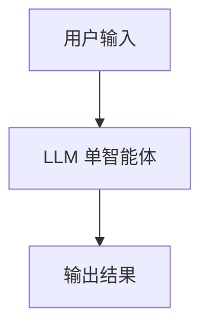
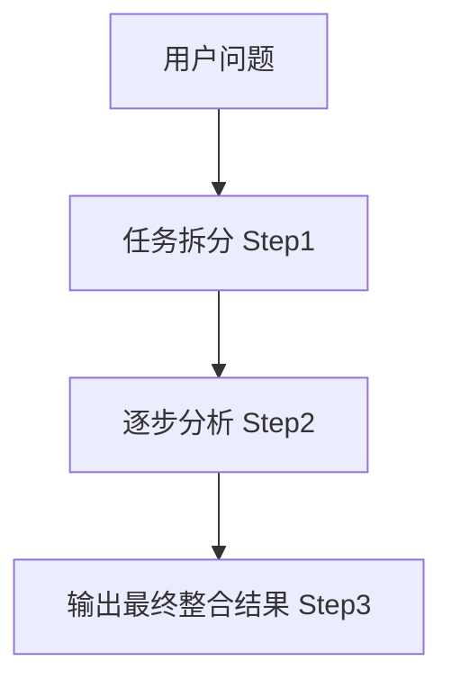
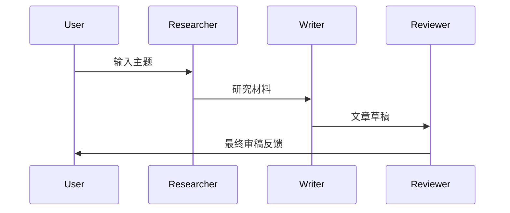

下面我给你 **一个可独立运行的 Node.js + LangChain.js + Ollama 项目工程**，涵盖你文章中所有示例：
**单智能体、工作流（链式）、多智能体（基于 messages routing 的 MAS）**。

你可以直接把下面内容复制为一个文件夹即可运行。

---

# ✅ **智能体应用完整示例工程（Node.js + LangChain.js + Ollama）**

## 📁 **项目结构**

```
agent-examples/
│
├── package.json
├── README.md
├── config.js
│
├── 01-single-agent/
│   ├── agent.js
│   └── run.js
│
├── 02-workflow/
│   ├── workflow.js
│   └── run.js
│
└── 03-multi-agent/
    ├── agents/
    │   ├── researcher.js
    │   ├── writer.js
    │   └── reviewer.js
    └── run.js
```

---

# 📦 **package.json**

```json
{
  "name": "agent-examples",
  "version": "1.0.0",
  "type": "module",
  "dependencies": {
    "@langchain/ollama": "latest",
    "@langchain/core": "latest",
    "@langchain/langgraph": "latest"
  }
}
```

---

# ⚙️ **config.js**

```js
export const MODEL = "llama3.1"; // 你本地 Ollama 的模型名称
```

---

# ============================

# **01. 单智能体示例**

# ============================

# 📁 01-single-agent/agent.js

```js
import { ChatOllama } from "@langchain/ollama";
import { MODEL } from "../config.js";

export function createSingleAgent() {
  return new ChatOllama({
    model: MODEL,
    temperature: 0.3,
  });
}
```

---

# 📁 01-single-agent/run.js

```js
import { createSingleAgent } from "./agent.js";

const agent = createSingleAgent();

const res = await agent.invoke("解释一下量子计算是什么？用最简单的方式。");
console.log("单智能体输出：\n", res);
```

---

# 📊 单智能体流程图（Mermaid）



---

# ============================

# **02. 工作流（Workflow / Chain）示例**

# ============================

工作流由多个“步骤函数”组成，通过输入 → 处理 → 输出逐步执行。

---

# 📁 02-workflow/workflow.js

```js
import { ChatOllama } from "@langchain/ollama";
import { MODEL } from "../config.js";

const llm = new ChatOllama({ model: MODEL });

export async function runWorkflow(question) {
  // Step 1: 拆分任务
  const step1 = await llm.invoke(`将下面的问题拆分成 3 个步骤：${question}`);

  // Step 2: 逐个步骤分析
  const step2 = await llm.invoke(`根据以下步骤进行分析：${step1.content}`);

  // Step 3: 生成最终总结
  const finalOutput = await llm.invoke(
    `将以下分析结果整合成最终答案：${step2.content}`
  );

  return {
    steps: step1.content,
    analysis: step2.content,
    final: finalOutput.content,
  };
}
```

---

# 📁 02-workflow/run.js

```js
import { runWorkflow } from "./workflow.js";

const res = await runWorkflow("解释一下为什么天空是蓝色的？");
console.log("步骤：", res.steps);
console.log("分析：", res.analysis);
console.log("最终答案：", res.final);
```

---

# 📊 工作流流程图



---

# ============================

# **03. 多智能体系统（MAS）示例**

# ============================

我们实现一个“研究员 → 撰稿人 → 审稿人”的多智能体协作系统。

---

# 📁 03-multi-agent/agents/researcher.js

```js
import { ChatOllama } from "@langchain/ollama";
import { MODEL } from "../../config.js";

export async function researcherAgent(topic) {
  const llm = new ChatOllama({ model: MODEL });
  return await llm.invoke(`你是一名研究员，请对主题进行调研：${topic}`);
}
```

---

# 📁 03-multi-agent/agents/writer.js

```js
import { ChatOllama } from "@langchain/ollama";
import { MODEL } from "../../config.js";

export async function writerAgent(research) {
  const llm = new ChatOllama({ model: MODEL });
  return await llm.invoke(`基于以下研究材料撰写一段文章：${research}`);
}
```

---

# 📁 03-multi-agent/agents/reviewer.js

```js
import { ChatOllama } from "@langchain/ollama";
import { MODEL } from "../../config.js";

export async function reviewerAgent(article) {
  const llm = new ChatOllama({ model: MODEL });
  return await llm.invoke(
    `你是一名审稿人，请审阅文章并给出改进建议：${article}`
  );
}
```

---

# 📁 03-multi-agent/run.js

```js
import { researcherAgent } from "./agents/researcher.js";
import { writerAgent } from "./agents/writer.js";
import { reviewerAgent } from "./agents/reviewer.js";

const topic = "人工智能如何帮助医学影像诊断？";

console.log("== 多智能体系统开始 ==\n");

const research = await researcherAgent(topic);
console.log("研究员输出：\n", research.content, "\n");

const article = await writerAgent(research.content);
console.log("撰稿人输出：\n", article.content, "\n");

const review = await reviewerAgent(article.content);
console.log("审稿人输出：\n", review.content, "\n");
```

---

# 📊 多智能体协作流程图



---

# ============================

# 🚀 **运行方式**

# ============================

## 1. 安装依赖

```bash
npm install
```

---

## 2. 运行三个示例

### 👉 单智能体

```bash
node 01-single-agent/run.js
```

### 👉 工作流（Workflow）

```bash
node 02-workflow/run.js
```

### 👉 多智能体系统（MAS）

```bash
node 03-multi-agent/run.js
```

---

# 🎁 额外福利（可选）

如果你需要，我可以继续生成：

✅ **对应文章完整内容（含简介+原理+示例+流程图）**
✅ **PDF / LaTeX 版本**
✅ **把所有示例整合成低代码框架 v0.1 版本**
✅ **支持前端调用的 RESTful API 服务版本**

你希望我继续生成哪部分？
