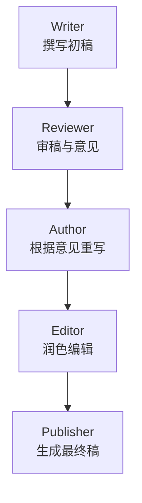

下面为你的多智能体项目生成一份 **专业、清晰、可直接放到 GitHub 的 README.md**。
内容包括：

✔ 项目介绍
✔ 架构图
✔ 功能说明
✔ 运行方式
✔ Agent 流程图
✔ 配置方式（本地模型 + 云端模型）
✔ 扩展开发建议

---

# README.md（可直接使用）

# 🧠 Multi-Agent Workflow Example

### 一个兼容 **本地 Ollama** 与 **云端大模型 API** 的多智能体协作示例

支持 **流式输出、可插拔模型、可扩展 Agent 体系**

---

## 📘 项目简介

本项目展示了一个明确、可运行的 **多智能体（Multi-Agent）写作协作系统**，包括以下角色：

1. **Writer（撰写人）**：生成初稿
2. **Reviewer（审稿人）**：给出修改意见
3. **Author（作者）**：根据意见重写
4. **Editor（编辑）**：润色与校对
5. **Publisher（发布者）**：生成最终成品文档

系统特点包括：

✔ 支持 **本地 Ollama**（如 qwen2.5、llama3.1）
✔ 支持 **云端模型 API**（如 OpenAI、DeepSeek、Moonshot、Groq）
✔ 默认使用 **流式输出（streaming）**，提升响应体验
✔ 完整的链式多智能体任务编排
✔ 易扩展、易替换模型、易增加新 Agent

---

## 📁 目录结构

```
multi-agent-demo/
 ├─ agents/
 │   ├─ writer.js        # 撰写人
 │   ├─ reviewer.js      # 审稿人
 │   ├─ author.js        # 作者
 │   ├─ editor.js        # 编辑
 │   └─ publisher.js     # 发布者
 ├─ llm.js               # 统一模型调用，本地+云端
 ├─ stream.js            # 流式输出处理
 ├─ orchestrator.js      # 多智能体串联执行
 ├─ package.json
 └─ README.md
```

---

## 🧩 架构图

### 多智能体流程架构



---

## 🧠 工作流说明

每个 Agent 执行任务后会输出内容，并将结果 **自动传递给下一个 Agent**。

例如 orchestrator：

```js
const draft = await writerAgent(topic);
const review = await reviewerAgent(draft);
const revised = await authorAgent(draft, review);
const polished = await editorAgent(revised);
const finalDoc = await publisherAgent(polished);
```

通过这种方式，整个系统形成一个线性但可扩展的工作流。

---

## ⚙️ 模型调用（本地 + 云端统一架构）

本项目通过 `llm.js` 实现统一大模型调用，支持两种模式：

### 1. 本地模型（Ollama）

只需把 model 设置成：

```
ollama:qwen2.5
ollama:llama3.2
ollama:deepseek-r1
```

程序将自动使用 Ollama API。

### 2. 云端模型（OpenAI / DeepSeek / Moonshot 等）

```
gpt-4o-mini
deepseek-chat
moonshot-v1-8k
groq-mixtral
```

你需要在环境变量中提供：

```
export OPENAI_API_KEY=xxx
export DEEPSEEK_API_KEY=xxx
export MOONSHOT_API_KEY=xxx
export GROQ_API_KEY=xxx
```

---

## 🧵 流式输出示例

运行过程中，将看到模型逐字输出文本：

```
=== Step 1: Writer ===
智能体是...
（流式输出中）
...
--- END ---

=== Step 2: Reviewer ===
该文章逻辑良好，但可以改进...
（流式输出中）
...
--- END ---
```

流式输出由 `stream.js` 实现，通过统一的 `printStream()` 方法支持：

- Ollama 原生流
- OpenAI-like API 流

---

## 🚀 如何运行

### 1. 安装依赖

```bash
npm install
```

### 2. 启动 Ollama（如使用本地模型）

```bash
ollama pull qwen2.5
```

### 3. 设置环境变量（如使用云端模型）

```bash
export OPENAI_API_KEY=你的key
```

### 4. 运行

```bash
node orchestrator.js
```

---

## 🔧 修改你要使用的模型

`orchestrator.js`：

```js
const MODEL = "ollama:qwen2.5";
// const MODEL = "gpt-4o-mini";
// const MODEL = "deepseek-chat";
// const MODEL = "moonshot-v1-8k";
```

---

## 🛠️ 如何扩展更多 Agent？

你只需要：

1. 在 `agents/` 新建一个文件，例如：

```
fact_checker.js
```

2. 新建一个函数：

```js
export async function factCheckerAgent(content, model) {
  const prompt = `请核查以下内容的事实正确性：${content}`;
  const stream = await runModel({ model, prompt, streaming: true });
  return await printStream(stream);
}
```

3. 在 `orchestrator.js` 插入它：

```js
const checked = await factCheckerAgent(polished, MODEL);
```

系统自动继续执行。

---

## 📌 适合用于哪些项目？

- 多智能体论文写作 / 稿件协作
- Agent 团队（如 ReAct、AutoGPT、ChatDev）
- 基于角色的长流程自动化
- AI 工作流平台（Workflow Engine）
- 数据处理流水线
- 智能客服、助手编排

---

## 🧭 下一步建议

如果你愿意，还可以继续升级：

### ✔ Web Dashboard（显示所有 Agent 状态）

### ✔ 多智能体调度器（并行 + 任务分配）

### ✔ Agent 内部记忆（Memory）

### ✔ 插件系统（工具调用 Tool Calling）

### ✔ 文本转知识库（RAG 支持）

我可以继续为你构建完整框架，只需要告诉我你想要哪个方向。

---

如果你需要，我也能为此生成：

📁 **完整压缩包（zip）格式项目**
🌐 **一个带可视化 UI 的 Web 前端**
⚙️ **一个可复用的多智能体 SDK（你的项目可通用）**

需要继续扩展吗？
