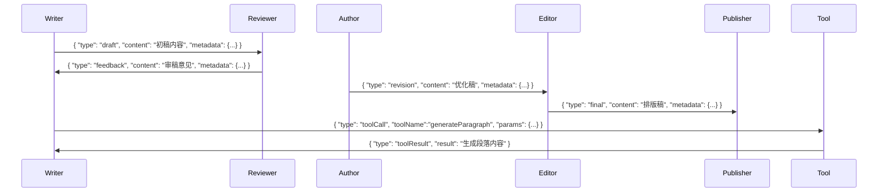
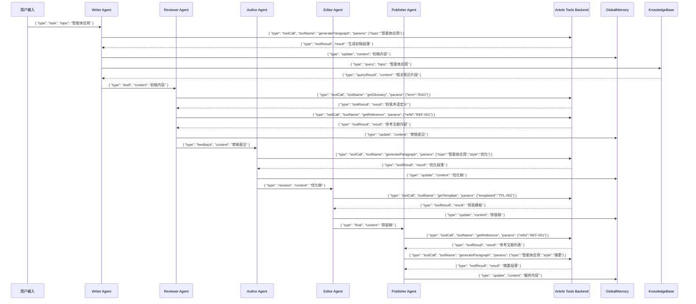
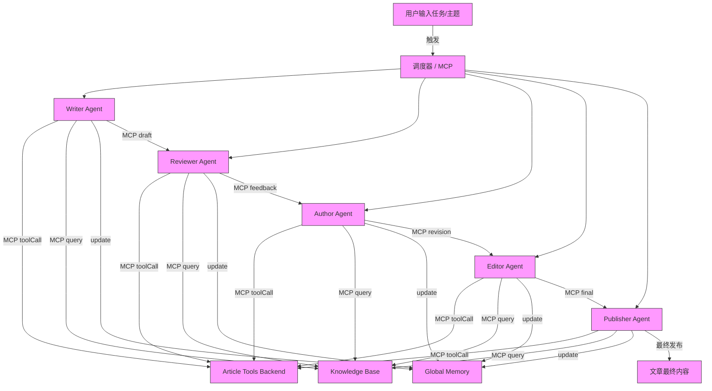

明白了，你说的 **MCP 是“模型通信协议”（Model Communication Protocol）**，那它和你现在的多智能体系统（五 Agent + 工具 + 知识库）之间的关系就不同了，我详细说明一下。

---

## 1️⃣ MCP（Model Communication Protocol）概念

**MCP** 是一种用于 **模型之间互相通信的标准协议**，核心目标是：

1. **统一消息格式**
   - 模型或智能体之间交换信息时，使用统一的 JSON 或结构化消息。
   - 例如：
     ```json
     {
       "sender": "WriterAgent",
       "receiver": "ReviewerAgent",
       "content": "初稿内容",
       "metadata": {
         "timestamp": "2025-12-03T12:00:00Z",
         "toolsUsed": ["generateParagraph"]
       }
     }
     ```
2. **标准化请求/响应模式**
   - 支持请求/响应、事件通知或流式输出
   - 模型可通过 MCP 调用其他模型或工具，保持上下文一致。
3. **可扩展性**
   - 可以定义多种消息类型：文本、知识查询、工具调用请求、记忆更新、状态报告等。

---

## 2️⃣ MCP 与五 Agent 系统的关系

| 系统模块        | MCP 的作用                                             |
| --------------- | ------------------------------------------------------ |
| Writer Agent    | 通过 MCP 向 Reviewer 发送初稿消息；可请求工具生成段落  |
| Reviewer Agent  | 通过 MCP 接收初稿、发送审稿意见；可请求术语检查工具    |
| Author Agent    | 通过 MCP 接收审稿意见，生成优化内容                    |
| Editor Agent    | 通过 MCP 接收优化稿，进行排版和语言优化                |
| Publisher Agent | 通过 MCP 接收最终稿，生成发布内容                      |
| GlobalMemory    | MCP 消息可以携带上下文 ID，使每个 Agent 能获取前序状态 |
| 工具插件        | MCP 可封装工具调用请求和响应，统一接口格式             |

---

## 3️⃣ MCP 的消息示意



**说明：**

- **所有 Agent 间通信**都使用统一 MCP 消息格式
- **工具调用**也用 MCP 封装请求/响应
- **GlobalMemory** 可作为 MCP 消息的上下文存储，保证跨 Agent 一致性

---

## 4️⃣ MCP 在你系统中的好处

1. **统一多智能体通信**：不依赖具体函数调用，方便扩展新 Agent
2. **工具调用也标准化**：无论是 Ollama、云 API 还是本地工具，都通过 MCP 消息交互
3. **易于实现流式输出**：消息可以边生成边传递
4. **支持异步协作**：每个 Agent 可以独立处理消息，MCP 保证顺序和上下文一致

---

💡 总结：

- 在五 Agent 系统里，MCP 相当于 **Agent 与 Agent、Agent 与工具之间的“通信协议”**
- 当前 Scheduler + executeWithTools + GlobalMemory 可以看作 **MCP 的简化实现**
- 若要正式支持 MCP，你可以定义一个 **统一消息结构**，让所有 Agent、工具调用、知识库访问都通过 MCP 消息流交互

---

我可以帮你画一个 **五 Agent + 工具 + MCP 消息流示意图**，标出每个 Agent、工具调用和全局记忆的消息传递路径，这样直观理解模型通信协议在整个流程里的作用。

你希望我画吗？

明白，我帮你画一个 **五 Agent + 工具 + MCP 消息流示意图**，展示每个 Agent 如何通过 MCP（模型通信协议）互相通信，并调用工具和访问全局记忆。



---

### 🔹 说明

1. **MCP 消息格式统一**：
   - `type`: 消息类型（draft、feedback、toolCall、update、query 等）
   - `content` / `params`: 具体内容或参数
   - `sender` / `receiver`: 可扩展字段用于标识 Agent
2. **Agent 间通信**全部通过 MCP 消息流：
   - Writer → Reviewer → Author → Editor → Publisher
3. **工具调用统一通过 MCP**：
   - Writer/Reviewer/Author/Editor/Publisher 都可以调用 Article Tools Backend
   - 返回结果以 MCP 消息返回，并写入 GlobalMemory
4. **全局记忆和知识库**通过 MCP 消息管理，保证各 Agent 拥有上下文

---

如果你希望，我可以帮你 **画一个“更抽象的流程图”**，把五 Agent + 工具 + 知识库 + MCP 的**整体架构和数据流**用一张图展示，看起来更直观，不局限于序列时序图。

你希望我画吗？

明白，我帮你画一个 **五 Agent + 工具 +知识库 + MCP 的整体架构与数据流图**，展示整个系统运行和通信路径。



---

### 🔹 图示说明

1. **Scheduler/MCP**：核心调度器，管理 Agent 执行顺序与通信
2. **五 Agent**：Writer、Reviewer、Author、Editor、Publisher
3. **工具调用**：每个 Agent 都可通过 MCP 消息调用 Article Tools Backend
4. **知识库查询**：Agent 可检索主题相关内容增强输出
5. **全局记忆**：统一存储 Agent 历史操作和内容
6. **Agent 间通信**：通过 MCP 消息（draft、feedback、revision、final）传递内容
7. **最终输出**：Publisher 生成最终文章

---

这张图可以作为你文章或 Demo 项目的 **架构示意图**，清晰展示五 Agent 系统如何通过 MCP 消息、工具、知识库和全局记忆协作完成文章生成任务。

如果你需要，我可以帮你 **再画一个带“流式输出”和“工具调用顺序”的更详细执行流程图**，方便展示动态执行过程。

你希望我画吗？
