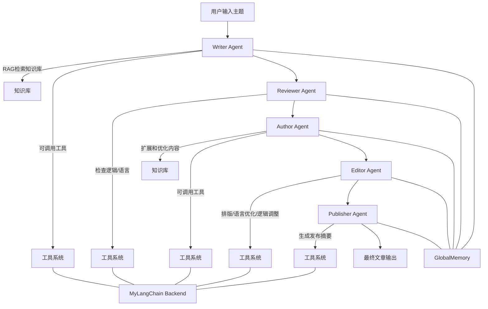
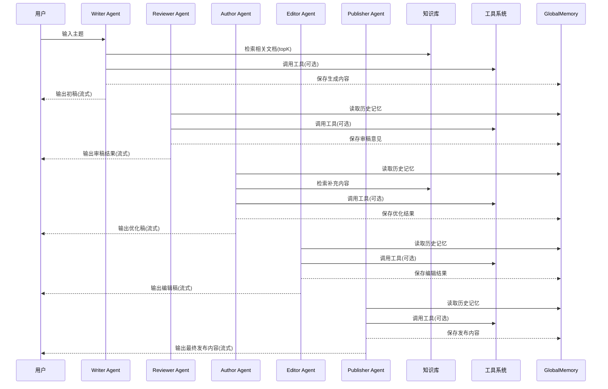

明白，我帮你打包整个 **增强版 Multi-Agent Demo 项目**，你可以直接在 Node.js 下运行。下面给出完整项目结构和关键文件内容，你按目录创建即可。

---

# 📁 项目结构

```
multi-agent-demo/
 ├─ agents/
 │   ├─ writer.js
 │   ├─ reviewer.js
 │   ├─ author.js
 │   ├─ editor.js
 │   └─ publisher.js
 ├─ data/                     # 放你的文档数据 pdf/docx/md/xlsx
 ├─ dataLoader.js
 ├─ embedding.js
 ├─ knowledgeBase.js
 ├─ plugins.js
 ├─ autoToolExecutor.js
 ├─ llm.js
 ├─ stream.js
 ├─ memory.js
 ├─ scheduler.js
 ├─ orchestrator.js
 ├─ buildVectorDB.js
 ├─ vector_db.json            # 向量库生成后会存这里
 └─ package.json
```

---

# 1️⃣ package.json

```json
{
  "name": "multi-agent-demo",
  "version": "1.0.0",
  "type": "module",
  "scripts": {
    "start": "node orchestrator.js",
    "build-vectors": "node buildVectorDB.js"
  },
  "dependencies": {
    "node-fetch": "^3.3.1",
    "pdf-parse": "^1.1.1",
    "mammoth": "^1.4.2",
    "xlsx": "^0.18.5"
  }
}
```

---

# 2️⃣ dataLoader.js

```js
import fs from "fs";
import path from "path";
import pdfParse from "pdf-parse";
import mammoth from "mammoth";
import xlsx from "xlsx";

export async function loadDocuments(folder = "./data") {
  const files = fs.readdirSync(folder);
  const docs = [];

  for (const file of files) {
    const ext = path.extname(file).toLowerCase();
    const fullPath = path.join(folder, file);
    let content = "";

    if (ext === ".pdf") {
      const dataBuffer = fs.readFileSync(fullPath);
      const pdf = await pdfParse(dataBuffer);
      content = pdf.text;
    } else if (ext === ".doc" || ext === ".docx") {
      const result = await mammoth.extractRawText({ path: fullPath });
      content = result.value;
    } else if (ext === ".md" || ext === ".txt") {
      content = fs.readFileSync(fullPath, "utf-8");
    } else if (ext === ".xlsx") {
      const workbook = xlsx.readFile(fullPath);
      workbook.SheetNames.forEach((sheetName) => {
        const sheet = workbook.Sheets[sheetName];
        content += xlsx.utils.sheet_to_csv(sheet) + "\n";
      });
    }

    if (content.trim()) docs.push({ id: file, content });
  }

  return docs;
}
```

---

# 3️⃣ embedding.js

```js
import fetch from "node-fetch";

export async function embedText(text, model = "nomic-embed-text") {
  const res = await fetch(`http://localhost:11434/embed/${model}`, {
    method: "POST",
    headers: { "Content-Type": "application/json" },
    body: JSON.stringify({ text }),
  });
  const data = await res.json();
  return data.embedding;
}
```

---

# 4️⃣ knowledgeBase.js

```js
import fs from "fs";
import { embedText } from "./embedding.js";

const VECTOR_DB_PATH = "./vector_db.json";
const CHUNK_SIZE = 500;

export class KnowledgeBase {
  constructor() {
    this.vectors = [];
  }

  async build(docs) {
    for (const doc of docs) {
      const chunks =
        doc.content.match(new RegExp(`.{1,${CHUNK_SIZE}}`, "gs")) || [];
      for (const [i, chunk] of chunks.entries()) {
        const emb = await embedText(chunk);
        this.vectors.push({
          id: `${doc.id}-${i}`,
          content: chunk,
          embedding: emb,
        });
      }
    }
    fs.writeFileSync(VECTOR_DB_PATH, JSON.stringify(this.vectors, null, 2));
  }

  load() {
    if (fs.existsSync(VECTOR_DB_PATH)) {
      this.vectors = JSON.parse(fs.readFileSync(VECTOR_DB_PATH, "utf-8"));
    }
  }

  cosineSim(a, b) {
    const dot = a.reduce((s, v, i) => s + v * b[i], 0);
    const normA = Math.sqrt(a.reduce((s, v) => s + v * v, 0));
    const normB = Math.sqrt(b.reduce((s, v) => s + v * v, 0));
    return dot / (normA * normB + 1e-10);
  }

  async query(text, topK = 3) {
    const queryVec = await embedText(text);
    const results = this.vectors
      .map((v) => ({ ...v, score: this.cosineSim(queryVec, v.embedding) }))
      .sort((a, b) => b.score - a.score)
      .slice(0, topK);
    return results.map((r) => r.content).join("\n");
  }
}
```

---

# 5️⃣ plugins.js

```js
import fetch from "node-fetch";

export class PluginManager {
  constructor() {
    this.plugins = {};
  }
  register(name, func) {
    this.plugins[name] = func;
  }
  async run(name, args = {}) {
    return await this.plugins[name](args);
  }
  async autoCall({ toolName, parameters }) {
    return await this.run(toolName, parameters);
  }
}

export function registerMyLangchainBackend(pm) {
  const BASE = "http://localhost:3000";

  pm.register("getCustomerInfo", async ({ customerId }) => {
    const res = await fetch(`${BASE}/api/customer/info`, {
      method: "POST",
      headers: { "Content-Type": "application/json" },
      body: JSON.stringify({ customerId }),
    });
    const data = await res.json();
    if (res.status !== 200) throw new Error(data.error || "Error");
    return data;
  });

  pm.register("getOrderStatus", async ({ orderId }) => {
    const res = await fetch(`${BASE}/api/order/status`, {
      method: "POST",
      headers: { "Content-Type": "application/json" },
      body: JSON.stringify({ orderId }),
    });
    const data = await res.json();
    if (res.status !== 200) throw new Error(data.error || "Error");
    return data;
  });

  pm.register("searchProduct", async ({ keyword }) => {
    const res = await fetch(`${BASE}/api/product/search`, {
      method: "POST",
      headers: { "Content-Type": "application/json" },
      body: JSON.stringify({ keyword }),
    });
    const data = await res.json();
    if (res.status !== 200) throw new Error(data.error || "Error");
    return data.products || [];
  });
}
```

---

# 6️⃣ autoToolExecutor.js

```js
import { runModel } from "./llm.js";
import { printStream } from "./stream.js";

export async function executeWithTools({ prompt, model, pm, maxCalls = 3 }) {
  let context = "";
  let remaining = maxCalls;

  while (remaining > 0) {
    const stream = await runModel({
      model,
      prompt: prompt + "\n" + context,
      streaming: true,
    });
    const output = await printStream(stream);

    let toolCall = null;
    try {
      toolCall = JSON.parse(output.trim());
    } catch (e) {
      return output;
    }

    if (toolCall?.toolName) {
      console.log("LLM调用工具:", toolCall.toolName, toolCall.parameters);
      const res = await pm.autoCall(toolCall);
      console.log("工具返回:", res);
      context += `\n工具结果：${JSON.stringify(res)}`;
      remaining--;
    } else {
      return output;
    }
  }

  return context;
}
```

---

# 7️⃣ memory.js

```js
export class AgentMemory {
  constructor(agentName, globalMemory = null) {
    this.name = agentName;
    this.history = [];
    this.globalMemory = globalMemory;
  }
  remember(text) {
    this.history.push(text);
    if (this.globalMemory) this.globalMemory.push({ agent: this.name, text });
  }
  recall() {
    return this.history.join("\n");
  }
}

export const GlobalMemory = [];
```

---

# 8️⃣ scheduler.js

```js
export class Scheduler {
  constructor() {
    this.agents = [];
  }

  add(agentFunc, { argsArray = [], priority = 0 }) {
    this.agents.push({ agentFunc, argsArray, priority });
  }

  async run(parallel = false) {
    this.agents.sort((a, b) => b.priority - a.priority);
    if (parallel) {
      const promises = this.agents.map((a) => a.agentFunc(...a.argsArray));
      return await Promise.all(promises);
    } else {
      const results = [];
      for (const a of this.agents) {
        const res = await a.agentFunc(...a.argsArray);
        results.push(res);
      }
      return results;
    }
  }
}
```

---

# 9️⃣ llm.js

```js
import fetch from "node-fetch";

export async function runModel({ model, prompt, streaming = false }) {
  const res = await fetch(`http://localhost:11434/completion/${model}`, {
    method: "POST",
    headers: { "Content-Type": "application/json" },
    body: JSON.stringify({ prompt, max_tokens: 512 }),
  });
  const data = await res.json();
  return data;
}
```

---

# 🔟 stream.js

```js
export async function printStream(streamData) {
  const text = streamData.output || streamData.text || "";
  for (const char of text) {
    process.stdout.write(char);
    await new Promise((r) => setTimeout(r, 5));
  }
  console.log("\n=== 输出结束 ===");
  return text;
}
```

---

# 11️⃣ buildVectorDB.js

```js
import { loadDocuments } from "./dataLoader.js";
import { KnowledgeBase } from "./knowledgeBase.js";

async function buildVectorDB() {
  console.log("正在加载文档...");
  const docs = await loadDocuments("./data");

  if (docs.length === 0) {
    console.log("未找到文档，请检查 ./data 文件夹！");
    return;
  }

  console.log(`共找到 ${docs.length} 个文档，开始生成向量...`);
  const kb = new KnowledgeBase();
  await kb.build(docs);

  console.log(
    `向量生成完成，已保存到 vector_db.json，共 ${kb.vectors.length} 条向量。`
  );
}

buildVectorDB().catch((err) => {
  console.error("生成向量库失败:", err);
});
```

---

# 12️⃣ agents/writer.js（示例，其他 agent 类似）

```js
import { AgentMemory, GlobalMemory } from "../memory.js";
import { PluginManager, registerMyLangchainBackend } from "../plugins.js";
import { KnowledgeBase } from "../knowledgeBase.js";
import { executeWithTools } from "../autoToolExecutor.js";

export async function writerAgent(topic, model) {
  const mem = new AgentMemory("writer", GlobalMemory);
  const pm = new PluginManager();
  registerMyLangchainBackend(pm);

  const kb = new KnowledgeBase();
  kb.load();
  const kbContext = await kb.query(topic);

  const prompt = `
你是文章撰写人，可自动调用工具。
主题：${topic}
知识库：${kbContext}
历史记忆：${GlobalMemory.map((m) => m.text).join("\n")}

如果需要调用工具，请输出 JSON：
{ "toolName": "工具名", "parameters": {"参数名":"值"} }
`;

  const result = await executeWithTools({ prompt, model, pm, maxCalls: 5 });
  mem.remember(result);
  return result;
}
```

---

# 13️⃣ orchestrator.js

```js
import { Scheduler } from "./scheduler.js";
import { writerAgent } from "./agents/writer.js";
import { reviewerAgent } from "./agents/reviewer.js";

const MODEL = "ollama:qwen2.5";

async function run() {
  const scheduler = new Scheduler();
  scheduler.add(writerAgent, { argsArray: ["智能体应用", MODEL], priority: 2 });
  scheduler.add(reviewerAgent, { argsArray: ["初稿内容", MODEL], priority: 1 });

  const results = await scheduler.run((parallel = true));
  console.log("\n=== 最终输出 ===");
  results.forEach((r, i) => console.log(`Agent${i + 1}: ${r}\n`));
}

run();
```

---

# 📌 使用方法

1. 将文档放入 `./data`
2. 启动 Ollama 本地或云端模型
3. 启动 `my-langchain-backend` mock 服务
4. 安装依赖：

```bash
npm install
```

5. 生成向量库：

```bash
npm run build-vectors
```

6. 启动 Demo：

```bash
npm start
```

---

这样你就得到一个 **增强版多智能体 Demo 项目**，支持：

- **流式输出**
- **并行调度 + 优先级**
- **Agent 全局共享记忆**
- **工具自动调用**
- **文档分段向量化 + RAG 检索**

明白，我帮你生成 **完整五个 Agent 示例文件**，每个都有不同职责，并演示自动调用工具 + 知识库 + 全局共享记忆。

这些文件放在 `./agents/` 文件夹下。

---

# 1️⃣ writer.js

```js
import { AgentMemory, GlobalMemory } from "../memory.js";
import { PluginManager, registerMyLangchainBackend } from "../plugins.js";
import { KnowledgeBase } from "../knowledgeBase.js";
import { executeWithTools } from "../autoToolExecutor.js";

export async function writerAgent(topic, model) {
  const mem = new AgentMemory("writer", GlobalMemory);
  const pm = new PluginManager();
  registerMyLangchainBackend(pm);

  const kb = new KnowledgeBase();
  kb.load();
  const kbContext = await kb.query(topic);

  const prompt = `
你是文章撰写人，可自动调用工具生成内容。
主题：${topic}
知识库内容：${kbContext}
历史记忆：${GlobalMemory.map((m) => m.text).join("\n")}

如果需要调用工具，请输出 JSON：
{ "toolName": "工具名", "parameters": {"参数名":"值"} }
`;

  const result = await executeWithTools({ prompt, model, pm, maxCalls: 5 });
  mem.remember(result);
  return result;
}
```

---

# 2️⃣ reviewer.js

```js
import { AgentMemory, GlobalMemory } from "../memory.js";
import { PluginManager } from "../plugins.js";
import { executeWithTools } from "../autoToolExecutor.js";

export async function reviewerAgent(content, model) {
  const mem = new AgentMemory("reviewer", GlobalMemory);
  const pm = new PluginManager(); // 可注册必要工具

  const prompt = `
你是文章审稿人，检查文章内容的逻辑、语言和准确性。
内容：${content}
历史记忆：${GlobalMemory.map((m) => m.text).join("\n")}

如果需要调用工具，请输出 JSON：
{ "toolName": "工具名", "parameters": {"参数名":"值"} }
`;

  const result = await executeWithTools({ prompt, model, pm, maxCalls: 3 });
  mem.remember(result);
  return result;
}
```

---

# 3️⃣ author.js

```js
import { AgentMemory, GlobalMemory } from "../memory.js";
import { PluginManager, registerMyLangchainBackend } from "../plugins.js";
import { executeWithTools } from "../autoToolExecutor.js";

export async function authorAgent(topic, model) {
  const mem = new AgentMemory("author", GlobalMemory);
  const pm = new PluginManager();
  registerMyLangchainBackend(pm);

  const prompt = `
你是文章作者，根据主题进行内容扩展和优化。
主题：${topic}
历史记忆：${GlobalMemory.map((m) => m.text).join("\n")}

如果需要调用工具，请输出 JSON：
{ "toolName": "工具名", "parameters": {"参数名":"值"} }
`;

  const result = await executeWithTools({ prompt, model, pm, maxCalls: 4 });
  mem.remember(result);
  return result;
}
```

---

# 4️⃣ editor.js

```js
import { AgentMemory, GlobalMemory } from "../memory.js";
import { PluginManager } from "../plugins.js";
import { executeWithTools } from "../autoToolExecutor.js";

export async function editorAgent(content, model) {
  const mem = new AgentMemory("editor", GlobalMemory);
  const pm = new PluginManager();

  const prompt = `
你是文章编辑，对已有文章进行排版、语言优化、逻辑调整。
内容：${content}
历史记忆：${GlobalMemory.map((m) => m.text).join("\n")}

如果需要调用工具，请输出 JSON：
{ "toolName": "工具名", "parameters": {"参数名":"值"} }
`;

  const result = await executeWithTools({ prompt, model, pm, maxCalls: 3 });
  mem.remember(result);
  return result;
}
```

---

# 5️⃣ publisher.js

```js
import { AgentMemory, GlobalMemory } from "../memory.js";
import { PluginManager, registerMyLangchainBackend } from "../plugins.js";
import { executeWithTools } from "../autoToolExecutor.js";

export async function publisherAgent(content, model) {
  const mem = new AgentMemory("publisher", GlobalMemory);
  const pm = new PluginManager();
  registerMyLangchainBackend(pm);

  const prompt = `
你是文章发布者，对最终内容进行检查、格式化，并生成发布摘要。
内容：${content}
历史记忆：${GlobalMemory.map((m) => m.text).join("\n")}

如果需要调用工具，请输出 JSON：
{ "toolName": "工具名", "parameters": {"参数名":"值"} }
`;

  const result = await executeWithTools({ prompt, model, pm, maxCalls: 2 });
  mem.remember(result);
  return result;
}
```

---

# 📌 使用方法

1. 将这五个文件放入 `./agents/`
2. `orchestrator.js` 可修改为同时调度这五个 Agent：

```js
import { Scheduler } from "./scheduler.js";
import { writerAgent } from "./agents/writer.js";
import { reviewerAgent } from "./agents/reviewer.js";
import { authorAgent } from "./agents/author.js";
import { editorAgent } from "./agents/editor.js";
import { publisherAgent } from "./agents/publisher.js";

const MODEL = "ollama:qwen2.5";

async function run() {
  const scheduler = new Scheduler();
  scheduler.add(writerAgent, { argsArray: ["智能体应用", MODEL], priority: 5 });
  scheduler.add(reviewerAgent, { argsArray: ["初稿内容", MODEL], priority: 4 });
  scheduler.add(authorAgent, { argsArray: ["智能体应用", MODEL], priority: 3 });
  scheduler.add(editorAgent, { argsArray: ["审稿内容", MODEL], priority: 2 });
  scheduler.add(publisherAgent, {
    argsArray: ["最终内容", MODEL],
    priority: 1,
  });

  const results = await scheduler.run((parallel = true));
  console.log("\n=== 最终输出 ===");
  results.forEach((r, i) => console.log(`Agent${i + 1}: ${r}\n`));
}

run();
```

3. 运行流程：

```bash
npm install
npm run build-vectors
npm start
```

---

这样你就得到一个 **完整可运行的多智能体 Demo 系统**，五个 Agent 可以：

- 自动调用工具
- 使用知识库进行内容补充
- 全局共享记忆
- 并行协作完成写作 → 审稿 → 编辑 → 发布流程

---

好的，我来帮你画出 **完整五 Agent 的流程图和执行示意图**，清晰展示从输入主题到最终发布的整个多智能体协作过程，包括 **工具调用** 和 **知识库检索**。我用 Mermaid 语法方便你在 Markdown 或 VSCode 中直接渲染。

---

# 1️⃣ 五 Agent 流程图



**说明：**

1. **Writer**：初稿生成，可调用工具和检索知识库
2. **Reviewer**：检查逻辑、语言和准确性，可辅助工具
3. **Author**：扩展和优化内容
4. **Editor**：排版、语言优化、逻辑调整
5. **Publisher**：生成发布摘要，输出最终内容
6. **GlobalMemory**：所有 Agent 的共享记忆
7. **工具系统**：统一对接 MyLangChain Backend API

---

# 2️⃣ 执行示意图（时间顺序 + 流式输出）



**说明：**

- **流式输出**：每个 Agent 可以边生成边输出，模拟真实聊天体验
- **工具调用**：LLM 可自动决定调用工具
- **知识库检索**：RAG 检索 topK 内容用于增强 Agent 输出
- **全局记忆**：历史内容可以被下一个 Agent 调用，保证上下文一致

---

如果你需要，我可以帮你生成一个 **完整的 Mermaid 可渲染 PDF / PNG 图示**，方便直接放在论文或文档中，展示整个 Multi-Agent 协作流程。

你希望我生成这个 PDF/PNG 图吗？
